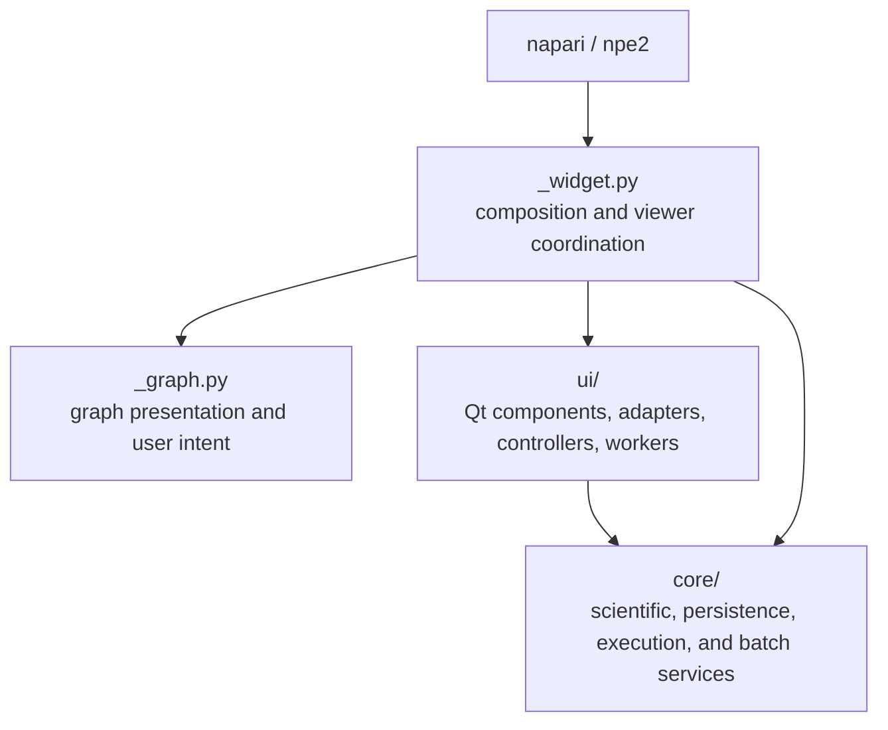

# Architecture and scientific boundaries

VIPP 0.12 separates scientific services from Qt presentation so the same
validated behavior can support interactive execution, generated Python, and
batch runs.



`core/` must not import napari, Qt, `_widget.py`, `_graph.py`, or `ui/`. `ui/`
may import Qt and `core/`, but must not import `_widget.py`. Architecture tests
enforce those directions. `_widget.py` can see every layer because it composes
the application; reusable policy should still move to the narrowest owner.

## Ownership map

| Responsibility | Primary owner |
| --- | --- |
| Numerical operations and parameter validation | `core/operations.py` |
| Node declarations, typed ports, and graph execution | `core/pipeline.py` |
| Axes, calibration, kind, channels, and history | `core/metadata.py` |
| Multi-image and image/PSF grid validation | `core/grid.py` |
| Exact statistics, histograms, percentiles, contrast, and label sizes | `core/diagnostics.py` |
| File/store identities and stable snapshots | `core/source_identity.py`, `core/file_sources.py` |
| Live napari-layer snapshots and invalidation | `ui/source_adapter.py` |
| Detached graph/workflow state | `core/snapshots.py`, `core/workflow.py` |
| Typed headless execution and Qt adaptation | `core/execution.py`, `ui/workers.py` |
| Atomic JSON/text replacement | `core/atomic_io.py` |
| Batch configuration, planning, and execution | `core/batch_setup.py`, `core/batch.py` |
| Retained batch UI and representative navigation | `ui/batch.py`, `ui/batch_controller.py`, `ui/batch_navigator.py` |
| Reusable controls, dialogs, plots, and dimensions | focused modules under `ui/` |
| Final application/viewer coordination | `_widget.py` |

## Non-negotiable scientific contracts

1. **Inputs are stable revisions.** Source bytes and metadata are detached and
   revision-checked; stale results are rejected.
2. **Axes and physical coordinates are data.** Explicit versus inferred
   semantic confidence matters. Multi-input compatibility includes axis
   meaning, size, scale, units, and origin—not shape alone.
3. **Diagnostic populations are declared and exact.** Chunking limits temporary
   memory; it is not sampling. Channel behavior is explicit.
4. **Invalid scientific parameters fail visibly.** Do not silently clamp,
   swap, fill, normalize, or substitute unless an explicit persisted policy
   defines that behavior.
5. **Operations preserve upstream buffers.** Scientific kernels accept
   read-only inputs and do not mutate source or cached arrays.
6. **Presentation is detached.** Viewer layers, contrast, colormaps,
   thumbnails, and provisional display ranges cannot change calculations.
7. **Persistence is validated and atomic per artifact.** Detached snapshots are
   graph-validated; non-finite JSON is rejected; replacement is fsynced and
   atomic. Several related files are not one transaction.
8. **Batch publication follows source verification.** Stage outputs, reverify
   every source, then promote; record partial publication explicitly.
9. **Export uses the shared executor.** Generated Python must preserve graph,
   source, metadata, version, and operation semantics.

## Execution boundaries

`GraphSnapshot` owns detached ordered nodes, connections, and tunnels.
`WorkflowSnapshot` adds positions, notes, and UI metadata. A document is
materialized through a temporary pipeline so ports, types, cycles, duplicate
inputs, and tunnel references are validated before it can replace live state.

Background work receives a typed `PipelineRunRequest` and returns a typed
`PipelineRunResult`. The Qt runnable forwards progress/results; the headless
service owns workflow reconstruction and calculation. A result is accepted
only while its run, graph, and source revision tokens remain current.

The same executor is used by the GUI and **Export Python...**. Batch adds a
deterministic planner, source identity checks, staged output promotion, and
manifest/sidecar provenance around that executor.

## Adding or changing behavior

For a scientific operation, define the population, axes/ranks, dtype and unit
behavior, parameter domain, output contract, edge cases, and reference method
before implementing it. Update operation registration, metadata propagation,
grid validation, workflow/export support, tests, user documentation, and
release notes together.

For a source, reuse normalized I/O and preserve its `ImageState`; add identity
capture and post-materialization verification. For a diagnostic, put the exact
calculation in `core/diagnostics.py`, Qt rendering in `ui/plots.py`, and typed
worker adaptation in `ui/diagnostic_workers.py`.

## Verification ladder

Use focused tests while developing, then run the complete release checks:

```bash
python -m npe2 validate src/napari_vipp/napari.yaml
python -m ruff check .
python -m pytest
python -m build
```

Add grid, source, snapshot, execution, batch, diagnostic, workflow, export, and
Qt integration tests in proportion to risk. Passing internal tests is not a
claim of assay-specific validation; keep that boundary visible in user-facing
documentation.
