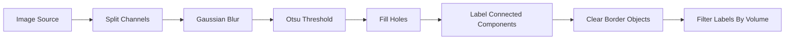

# Tour a finished workflow

This tour uses a complete, tested graph. You will inspect it—not rebuild it—so
you can learn the interface before dealing with graph editing.

## Open the example

Choose:

```text
Open example… → Segmentation & Labels → Red-Channel Label Cleanup
```

The `Image Source` is set to `VIPP synthetic multichannel volume`. Its channels
are blue, green, and red; this workflow uses the red/TRITC-like channel.


*Full interface context for the tour: the graph runs left to right below the
napari viewer, and the selected volume filter is editable in the inspector.*

## Read the graph from source to result



Each connection carries data from an output port to a compatible input port.
The visible graph records processing order, but it does not contain cached
pixel arrays.

## Inspect one decision at a time

Select each node from left to right:

1. **Split Channels:** confirm which output is the red signal.
2. **Gaussian Blur:** compare the source and smoothed thumbnails.
3. **Otsu Threshold:** inspect the binary foreground mask.
4. **Fill Holes:** look for changed interiors, not only object outlines.
5. **Label Connected Components:** confirm touching structures did not become
   implausible single objects.
6. **Clear Border Objects:** confirm that edge-touching biology was intentionally
   excluded.
7. **Filter Labels By Volume:** inspect the incoming size distribution and the
   labels that were removed.

Use **Pin selected** to keep an important output as a napari layer while you
select another node. A pinned layer is for comparison; it is not a new graph
connection.

## Change a parameter safely

Select **Gaussian Blur**, note its current value, and make a small change. Watch
the threshold mask and final labels update downstream. Undo the edit with the
toolbar undo action.

This demonstrates a central property of an interactive graph: one parameter
can change every downstream result. The ability to see that change helps with
review, but it does not tell you which value is biologically correct.

## Recognize manual nodes

Measurement, graph-analysis, RACC, and deconvolution nodes can use a
manual/cached calculation policy. When one is stale or has not run, select it
and choose **Calculate** or use **Calculate all**. After upstream changes the
button may read **Recalculate**.

## Save a copy

Choose **Save workflow…** and save the JSON under a new name. Reopen it with
**Load workflow…**. The graph and settings should return; cached images and
tables are deliberately recomputed from a source.

Next, [build the small graph yourself](build-workflow.md).
