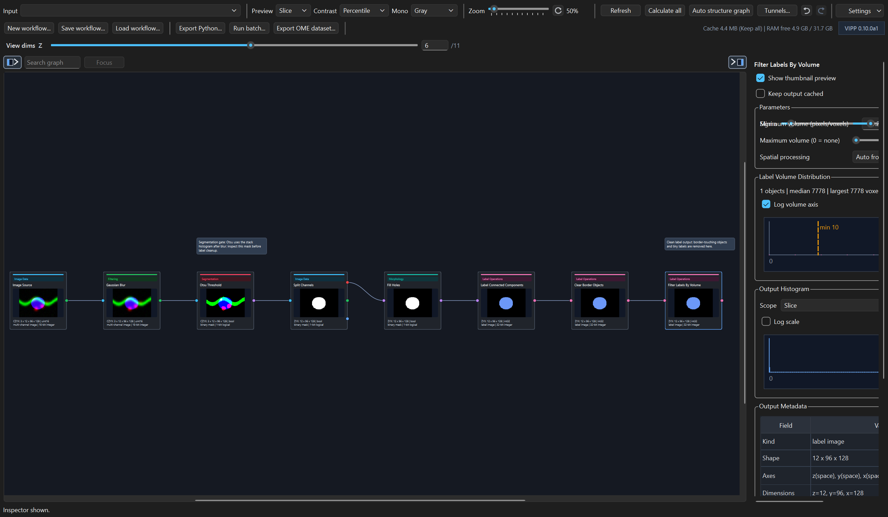

# First Workflow

This first workflow creates cleaned labels from one fluorescence channel. Once
the labels look reasonable, they can be measured in the next workflow step.

## Starting Point

Open the bundled sample data:

```text
File > Open Sample > VIPP synthetic microscopy samples
```

The most useful starting sample is:

```text
VIPP synthetic time-lapse multichannel
```

For a smaller first workflow, use:

```text
VIPP synthetic multichannel volume
```

## Screenshot



This screenshot shows the checked-in first label-cleanup workflow loaded in
VIPP as a detached, maximized window. The node library is hidden, the graph is
zoomed out to show the full workflow, and the inspector exposes the selected
label-filtering parameters.

## Build The Graph

Create this graph:

```text
Image Source
  -> Gaussian Blur
  -> Otsu Threshold
  -> Split Channels
  -> Fill Holes
  -> Label Connected Components
  -> Clear Border Objects
  -> Filter Labels By Volume
```

Natural next step:

```text
Filter Labels By Volume
  -> Measure Objects
```

## What To Inspect

Inspect these outputs before trusting the final table:

- the selected channel after `Split Channels`;
- the blurred image;
- the binary mask after `Otsu Threshold`;
- the cleaned mask after `Fill Holes`;
- the label image after `Label Connected Components`;
- the border-cleared and volume-filtered labels;
- the table preview after adding `Measure Objects`.

## Why This Workflow Matters

It demonstrates the central VIPP pattern:

1. Create an intermediate output.
2. Inspect it visually.
3. Tune the parameter.
4. Confirm the downstream effect.
5. Save the workflow and outputs.

The same graph can later be adapted for batch output or exported to Python.
