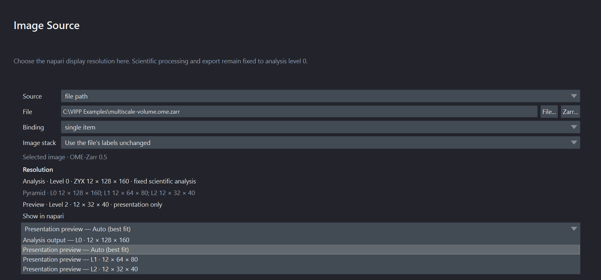

# Use your own images

An `Image Source` can read a napari layer, a local file or store, or a bundled
sample. Changing the source is easy; establishing that the workflow remains
valid is the important part.

## Choose a source route

| Route | Best for | Important limitation |
| --- | --- | --- |
| `napari layer` | Images already opened, cropped, or registered in napari | The workflow depends on a layer being present and correctly selected; unsupported live/lazy transforms can be rejected. |
| `file path` | A repeatable local file input | Moving, renaming, or replacing the file changes/breaks the source identity. |
| `sample` | Tutorials, regression checks, and demonstrations | Synthetic data does not establish performance on your assay. |
| Local OME-Zarr store | Multiscale multidimensional data with declared image or label groups | A lower level can accelerate presentation; one strictly eligible direct Crop Stack can also read only its retained level-0 window. Other graph paths remain eager. |

Select `Image Source`, set **Source**, and then use the control specific to that
route. The napari layer chooser is only shown for `napari layer`. The Image
Source card's live subtitle shows the current layer, sample, file, or collection
representative; hover the card for the complete binding when the subtitle is
elided.

You can also drop a supported image file directly onto an `Image Source` card.
With that card selected, ++ctrl+v++ (Windows/Linux) or ++cmd+v++ (macOS) opens a
copied image file or pasted image pixels. File paths remain file-backed inputs
with their reader metadata. Raw clipboard pixels become a normal napari layer;
RGB/RGBA colour semantics are preserved, but microscope calibration is not
invented. Review scale, axes, and units before measuring pasted pixels.

For a multi-image file or store, choose the intended **Series / image**. VIPP
records a stable `SourceItem v1` selector together with the reader/backend,
normalized axes and shape, and exact container revision. On reopen, a changed
file, missing companion, ambiguous legacy index, or unexpected reader topology
stops for review rather than silently choosing the item at the old numeric
position.

## Understand the source revision

During one interactive revision, VIPP does not repeatedly read an uncontrolled
moving target. A local file or directory store is identified before and after
inspection/materialization, detached into an owned read-only snapshot, and
pinned until **Refresh**. A revision changed during calculation is rejected.

NumPy-backed napari layers are also copied with a revision token. Data,
metadata, RGB, axis, scale, translation, unit, rotation, shear, and affine
events invalidate stale work. VIPP rejects live data or transforms that cannot
be frozen without changing pixels.

**Refresh** is the explicit instruction to accept the current source revision.
Record an external checksum or repository identifier for long-term provenance;
the workflow stores a source parameter/path, not the image bytes.

For local multiscale OME-Zarr 0.4/0.5, open the Image Source inspector's
**Resolution** section and use **Show in napari**. Its dynamic choices include
**Analysis output — L0**, **Presentation preview — Auto (best fit)**, and one
**Presentation preview — LN** entry for each lower level declared by the
selected image or label. A lower-level layer is labelled
`Preview level N - analysis remains full resolution`. It loads in the
background without replacing the active analysis or VIPP Inspect layer; choose
it explicitly when you want to view it. If loading fails, **Try loading preview
again** appears. The preview is a presentation aid only: the scientific graph,
batch run, generated execution, cache, and provenance remain bound to level 0.
A single-level source reports that no lower-level preview exists.

If a complete local OME-Zarr source cannot fit the safe host-RAM budget, Image
Source can offer **Add fitted Crop Stack** or **Fit existing Crop Stack** when an
exact direct read is provably safe. Accepting the action authors one visible
centred Crop or updates the existing eligible Crop as an undoable starting
point; VIPP does not silently crop, inspect image content to choose a biological
ROI, or promise that downstream processing will fit. Review every margin before
analysis. Branches, tunnels, bypassed Crops, ambiguous axes or identity, and
unsupported readers retain the ordinary full-read preflight.

*A synthetic three-level OME-Zarr illustrates the dynamic display choices. The
selected presentation level changes only napari's view; analysis stays on L0.
This compact source fits the safe RAM budget, so the conditional fitted-Crop
action is not shown.*

## Check metadata before processing

Confirm at minimum:

- array shape and semantic axes (`T`, `C`, `Z`, `Y`, `X`);
- channel order and names;
- pixel size, z-step, and unit;
- whether the data is intensity, RGB, a binary mask, or labels;
- whether the reader selected the intended image/series.

For a multi-input node, also confirm that corresponding axes describe the same
physical grid. Equal shape does not prove equal scale, units, origin, or axis
meaning. VIPP rejects detected mismatches rather than resampling silently.

Use `Reorder Axes` only when you understand the actual stored order. Use
`Set Pixel Size / Units` to repair missing or known-wrong calibration, and
record where the corrected values came from.

For an ordinary TIFF that reports generic `QYX`, use the Image Source node's
**Image stack** chooser instead of trying to rename Q with `Reorder Axes`.
Choose **Stack planes are depth slices (Z stack)** only after confirming the page
meaning; the resulting `QYX -> ZYX` declaration is saved with the workflow and
does not move pixels. Batch workspace uses the same control and can visibly
suggest that choice only when the workflow demonstrates a `ZYX` requirement.
Keep the suggestion only after review, and verify Z spacing separately.

For optional microscope readers, inspection and full read share one normalized
metadata contract. Still verify the selected item, reader/backend, displayed
axis order, array shape, channels, calibration, and movement of every T/Z/C
control on representative facility files. Native LIF, CZI, OIR, OIB, and LSM
pixel reads remain eager, and optional Bio-Formats routes require Java and the
needed codecs.

## Transfer a workflow deliberately

Do not judge transfer only from the final object count. On representative
images from the new acquisition family:

1. Inspect raw channel quality and background.
2. Inspect every threshold or segmentation boundary.
3. Check objects at image edges and across z.
4. Compare against independent reference annotations or agreed QC examples.
5. Retune only on a defined tuning subset.
6. Evaluate the frozen workflow on held-out images.

Changes in objective, exposure, stain, detector, bit depth, sampling, tissue,
or preprocessing can invalidate parameters that worked previously.

When moving to 0.15.0a2, keep the original workflow and open a duplicate. Valid
schema-3, schema-4, and schema-5 files migrate to schema 6. Schema-3/4 sources
acquire canonical SourceItems when they resolve, while schema 5 retains its
saved SourceItems; schema 6 preserves safe-node bypass intent. Inspect graph
structure, selected items, reader/backend, axes, calibration, parameters,
bypass choices, dynamic ports, and decisive outputs before saving the duplicate.
Rebuild schema-1/2 workflows deliberately; changing only the JSON version is
unsafe. See
[versions and compatibility](../reference/versioning.md).

## Protect sensitive data

Workflow JSON may contain local paths, source names, graph notes, or metadata
values. Review it before sharing publicly. Do not use patient identifiers,
restricted paths, or unpublished biological conclusions in screenshots,
examples, notes, or metadata columns.

Continue to [segmentation](../workflows/segmentation-label-cleanup.md),
[measurements](../workflows/object-measurements-tables.md), or the
[scientific-practice checklist](../scientific-practice/index.md).
