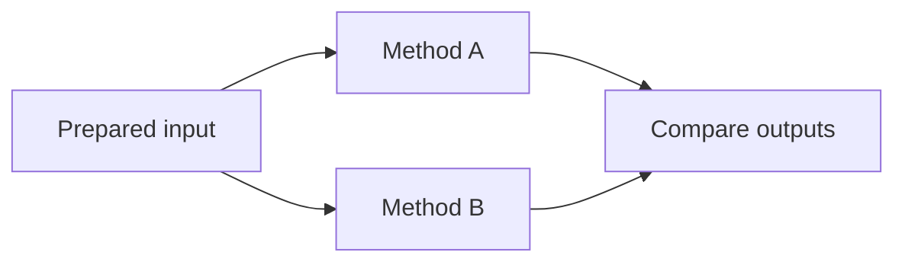

# Edit and organize a graph

## Add or insert a node

Search the node library by title or operation ID, then add a node to the
canvas. Connect an output port to a compatible input. When inserting into an
existing branch, use the connection insertion affordance if the candidate node
accepts the upstream type and can produce the downstream type.

If no node is compatible, inspect both port types. Converting a mask to labels
usually needs `Label Connected Components`; applying an image as if it were a
mask is not an acceptable type conversion.

## Undo, duplicate, and delete

Use undo/redo for graph edits and parameter changes. Duplicate a configured
node when comparing two parameter choices, then branch both from the same
upstream output. Delete a branch only after confirming that no output, tunnel,
or table merge still depends on it.

## Keep long graphs readable

- Arrange flow from left to right.
- Put alternative methods on parallel branches, not one after another.
- Keep source, QC, and output nodes visually distinct.
- Use **Auto structure graph** as a starting point, then preserve meaningful
  parallel alignment.
- Add graph notes at decisions: why a channel was selected, how a threshold was
  chosen, or what an exclusion means.
- Use graph search to find titles, operation IDs, tunnel names, and batch tags.

## Use tunnels for repeated sources

Named tunnels let one output feed distant nodes without long crossing wires.
Create a tunnel from an output, give it a semantic name such as `nuclei_labels`
or `red_channel`, and attach compatible inputs as subscribers.

Tunnels change graph presentation, not data. Rename a tunnel when its meaning
changes; never leave a subscriber attached to a misleading name. Use
**Tunnels…** to focus the source, reveal subscribers, rename, or remove it.

## Show alternatives honestly

Two methods being compared should share the same input and run in parallel:

Serial placement (`Method A → Method B`) means that B operates on A's output;
it is not a side-by-side comparison.

## Save before structural changes

Save a named workflow checkpoint before replacing a segmentation method,
changing axes, or rewiring measurement branches. Version control is preferable
for important workflow JSON files because it makes parameter and connection
changes reviewable.
