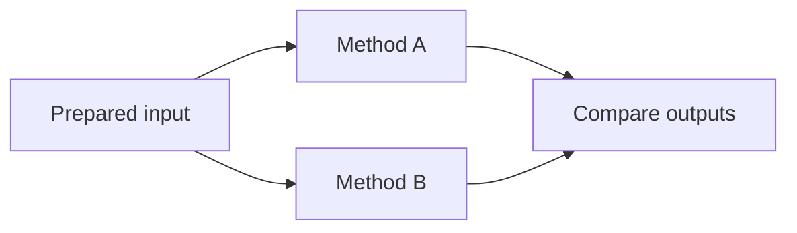

# Edit and organize a graph

## Add or insert a node

Search the node library by title or operation ID, then add a node to the
canvas. Connect an output port to a compatible input. Drop a compatible palette
item onto an existing wire to insert it without rebuilding the branch.
A compatible loose node—including one pasted into open space—can also be
dragged onto a wire. The wire highlights green when insertion is valid; release
the node while it is highlighted to split the connection and insert the node.
The insertion is one undoable graph edit.

An `Image Source` card shows its current layer, sample, file, or collection
representative as a live subtitle. Hover for the complete binding. The subtitle
follows representative changes and is a quick way to catch a graph connected
to the wrong input without opening every source inspector.

If no node is compatible, inspect both port types. Converting a mask to labels
usually needs `Label Connected Components`; applying an image as if it were a
mask is not an acceptable type conversion.

## Insert processing before a tunnel

To add a step before an existing named tunnel, right-click the tunnel and choose
**Insert node before tunnel**. You can also drop a compatible palette item on
the tunnel or drag a loose compatible node onto it. VIPP shows only operations
that accept the tunnel source and can still supply its subscribers.

The original subscribers keep the same named tunnel. The inserted node becomes
the tunnel's new source, so review whether the tunnel name still describes the
processed data. The complete insertion is one undoable edit.

## Select and move several nodes

On Windows, hold **Shift** while clicking to add nodes to the selection. Hold
**Ctrl** while clicking to add or remove an individual node. Drag any selected
node to move the group together. Group deletion and movement are single
undoable edits; tunnels or external wires are changed only when the chosen
action explicitly requires it.

## Name a node

!!! info "Unreleased — after 0.15.0a5"
    Table Source, Statistics and Plot Results receive descriptive automatic
    names. You can give any node a custom name to explain its purpose.

1. Select the node and edit **Name** at the top of its inspector, or right-click
   the node and choose **Rename…**.
2. Use a short description such as **Smooth nuclei**, **Nuclear intensity by
   well** or **Cell-area distribution**. Names accept up to 200 characters on
   one line.
3. Clear **Name**, or choose **Reset**, to return to the automatic
   label.

The graph, Results Workspace, workflow search and connected-input descriptions
use the same name. The operation type, such as **Statistics**, remains visible
as context, and the settings summary follows the current measurements,
grouping or plot choices even when a custom name stays unchanged. Hover when
text is shortened to read the complete label and settings.

Automatic labels use the dataset title or filename for **Table Source**,
selected measurements and grouping for **Statistics**, and the figure title
or selected plot settings for **Plot Results**. Column names are used as saved;
VIPP does not infer that a generically named intensity column represents a
particular cell compartment. Add a custom name when you know its meaning.

Statistics adds **Image averages** or **Sample averages** to its automatic
name when that observation level is selected, for example
**3 measurements by Treatment · Sample averages**. The settings summary
retains the full observation and weighting choices. In narrow inspectors the
Name field uses the full width and the settings summary uses at most three
lines; hover to read the full name or settings.

Matching names gain source context, then a short stable identifier if needed.
They still refer to distinct nodes. Save the workflow to retain custom names;
renaming and resetting support undo/redo without recalculating the analysis.
Renaming a Plot Results node does not edit its figure title. Change the title
under the plot's **Appearance** controls when it should appear in the figure.

## Copy nodes, fragments, or values

- Right-click a node and choose **Copy**, or use **Ctrl+C**.
- Copying several selected nodes includes their connections to one another,
  relevant tunnels, notes, authored settings, and relative layout.
- Right-click blank canvas space and choose **Paste here** to choose the
  location. **Ctrl+V** pastes the copied node or fragment near the center of
  the visible canvas.
- To copy settings without creating another node, copy one node, right-click a
  node for the exact same operation, and choose **Paste Values**. VIPP validates
  all values first and changes the destination once; incompatible operation
  types are refused.

Pasted graph nodes receive fresh identities. Connections to nodes outside the
copied selection are not silently recreated. Inspect the pasted fragment before
using it for a consequential calculation.

In unreleased builds, copy/paste and duplication also retain custom node
names. Repeated names are distinguished in the destination workflow.
**Paste Values** keeps the destination node's name.

Open **Graph Editing Acceptance Check** through **Open example…** in the
[workflow actions menu](../reference/interface.md#workflow-actions-menu) for numbered
notes that exercise tunnel insertion, value transfer, fragment copy/paste,
group movement, and undo/redo.

## Undo, duplicate, and delete

Use undo/redo for graph edits and parameter changes. A parameter undo restores
that node in place, retains unaffected cards, thumbnails, viewer layers, and
caches, then recalculates only the changed node and its descendants. Dragging a
slider records one edit when the press-drag-release gesture finishes rather
than one history entry for each intermediate calculated value.

Copy or duplicate a configured node when comparing two parameter choices, then
branch both from the same upstream output. Delete a branch only after confirming
that no output, tunnel, or table merge still depends on it.

## Bypass a compatible processing node

Select a node and check **Bypass node**, or right-click it and choose **Bypass
node**. VIPP forwards the exact first/main input to every compatible consumer
without deleting the node or changing its stored parameters. For a multi-input
restoration operation such as RL or RL-TV, this means Image/intensity is
forwarded and PSF is ignored.

Bypass is available only when the live topology proves the splice safe. Sources,
writers, unused terminal nodes, tunnels, dynamic or multiple outputs such as
Split Channels, and type-incompatible consumers cannot enter bypass. Clear the
checkbox or context-menu action to run the node again.

A bypassed card keeps its **Bypassed** badge, faded dotted outline, and
pass-through cue. Its thumbnail may still show a presentation-only would-run
preview so parameters remain understandable; those hypothetical pixels never
enter downstream analysis, cache identity, timing, export, batch output, or
provenance. The bypass choice itself is saved, hashed, undoable, and recorded in
execution provenance.

Use bypass for an explicit comparison, not to hide uncertainty. Record why the
step was omitted and recalculate decisive outputs before accepting the branch.

## Keep long graphs readable

- Arrange flow from left to right.
- Put alternative methods on parallel branches, not one after another.
- Keep source, QC, and output nodes visually distinct.
- Use **Auto Arrange** in the graph context row (or the
  [workflow actions menu](../reference/interface.md#workflow-actions-menu) when
  the control is hidden in a narrow window) as a
  starting point, then preserve meaningful
  parallel alignment.
- Add graph notes at decisions: why a channel was selected, how a threshold was
  chosen, or what an exclusion means.
- Use graph search to find titles, operation IDs, tunnel names, and batch tags.

!!! info "Improved in 0.15.0a4"

    Wires now go around their source and destination cards when a connection
    runs back to the left or between cards in the same column. They also avoid
    nearby cards where space allows, including between closely placed ports.
    While dragging, attached wires keep clear of their endpoint cards; routes
    around other cards settle when you release. Overlapping cards can still
    hide connections: separate them or use **Auto Arrange**.

### Choose a port-label mode

Open **Display settings → Input/output labels**, with **When needed**, **Always**, and **Never**. The behavior is unchanged from earlier labels; see
[Graph display settings](../reference/display-settings.md) for the label mapping.

The setting has three display modes:

| Mode | Behavior |
| --- | --- |
| `When needed` | Default. Show persistent names on nodes with more than one input or output, where choosing the correct port matters. |
| `Always` | Label every input and output port. Useful while learning or reviewing a workflow. |
| `Never` | Hide persistent labels for the most compact graph; hover and connection behavior are unchanged. |

Long names are elided on the card and show their full text in a tooltip. Labels
reserve card space but deliberately do not reposition the graph when the mode
changes. If existing cards now overlap, the VIPP message strip reports how many
pairs overlap. Run **Auto Arrange** to rebuild a size-aware source-to-sink
layout, or move those cards manually. Auto Arrange remains a one-shot,
undoable layout edit; port-label visibility does not change the workflow's
connections or scientific calculation.

## Search the workflow

Use **Find in workflow** to match node titles, operation IDs, tunnel names,
and output tags. Unreleased builds also match automatic and custom node names.
Press Enter or the adjacent **Focus** to move through matches.
Tunnel matches reveal the source and its subscribers.

Both workflow search and the node-library
search have an in-field magnifier. Workflow search widens with the window.
**Ctrl+F** (**Cmd+F** on macOS) focuses it and selects the existing query only
when napari or another host shortcut has not claimed the key. Existing bindings
retain priority, including those added after VIPP opens.

## Use tunnels for repeated sources

Named tunnels let one output feed distant nodes without long crossing wires.
Create a tunnel from an output, give it a semantic name such as `nuclei_labels`
or `red_channel`, and attach compatible inputs as subscribers.

Tunnels change graph presentation, not data. Rename a tunnel when its meaning
changes; never leave a subscriber attached to a misleading name. Use
**Tunnels...** to focus the source, reveal subscribers, rename, or remove it.

To reroute a named output tunnel, drag its source badge to another compatible
output. Preview and commit use the same port-type, cycle, and topology checks;
an accepted reroute is one atomic, undoable graph edit. Subscribers keep the
tunnel name, so rename it as part of the review if the new source changes its
scientific meaning.

## Show alternatives honestly

Two methods being compared should share the same input and run in parallel:

```mermaid
flowchart LR
  A["Prepared input"] --> B["Method A"]
  A --> C["Method B"]
  B --> D["Compare outputs"]
  C --> D
```

Serial placement (`Method A → Method B`) means that B operates on A's output;
it is not a side-by-side comparison.

## Save before structural changes

Save a named workflow checkpoint before replacing a segmentation method,
changing axes, or rewiring measurement branches. Version control is preferable
for important workflow JSON files because it makes parameter and connection
changes reviewable.

If a node is currently being tuned in isolation, a history-backed graph edit
(including layout, notes, undo/redo, loading another workflow, or structural
changes) first applies the current tuning result. This prevents **Cancel
tuning** from restoring state across two different graph revisions. The
temporary isolation boundary itself is session-only and is never saved in the
workflow.
