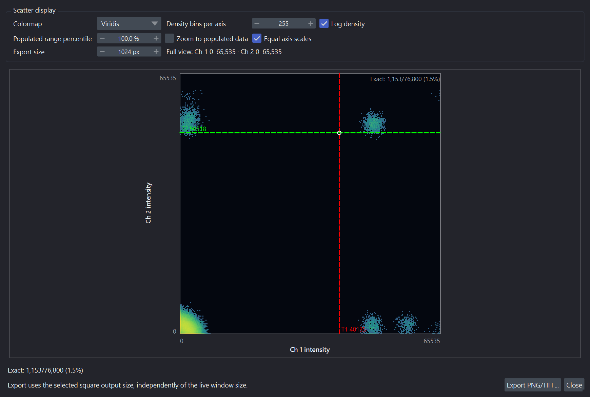
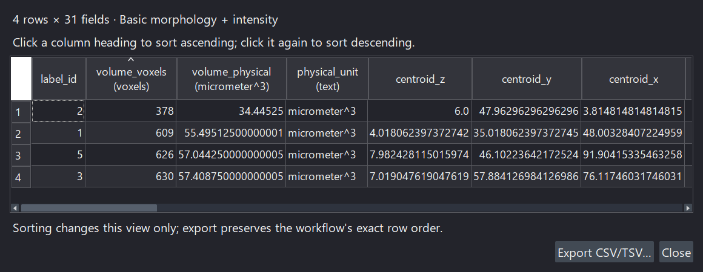

# Inspect and compare outputs

VIPP has several inspection surfaces. Choose the one that answers the question
rather than treating a thumbnail as evidence for every decision.

| Surface | Good for | Not sufficient for |
| --- | --- | --- |
| Node thumbnail | Rapid whole-graph scan | Fine boundaries, rare failures, or quantitative QC |
| Inspector preview | Selected node at a controlled slice/MIP | Comparing many full-resolution layers |
| Pinned napari layer | Full-resolution comparison and overlay | Recording why a parameter was selected |
| Histogram | Dynamic range and threshold context | Spatial correctness |
| Label-volume histogram | Size-filter cutoff review | Shape or identity correctness |
| Table preview | Columns, rows, units, obvious missingness | Statistical validation of measurements |

## Use the inspector for the selected data

The inspector now presents sections according to the node's scientific role.
Image operations show intensity distributions; masks show foreground occupancy;
labels show object-size distributions rather than a misleading histogram of
label IDs. **Filter Labels By Property** shows the selected measurement and
range. Metadata-only nodes emphasize axes and calibration without duplicating
an unchanged intensity histogram.

Measurement nodes put **Results** near their settings. Colocalization nodes
prioritize joint scatter and thresholds. Shared **Behavior**, **Compute**,
**Output Metadata**, and history sections remain available below. Expand the
section you need; the inspector is not a requirement to use every diagnostic.

Connected inputs identify which branch supplies each named input. When a node
has multiple outputs, select the output you intend to inspect or save. Always
check whether the displayed result is current, stale, or still calculating.

## Read Display Summaries Correctly

An inspector histogram counts every finite value in the chosen slice or stack,
then groups those counts into a compact chart. Its chart bins are independent
of the saved **Float histogram bins** used by histogram-based automatic
threshold nodes. Changing plot log scale or appearance does not change the
mask.

**Unreleased (after 0.15.0a4):** the **Intensity Histogram** node's inspector
plot grows vertically to keep the graph, axis labels and wrapped channel legend
readable in a narrow panel or with larger fonts. Scroll the inspector to reach
the sections below it. **Open in window** still provides a resizable detailed
view; resizing does not recalculate or change the histogram values.

The colocalization scatter density, ROI population, and colocalized count are
also calculated over every ROI voxel. Threshold-independent density remains
visible while exact threshold-dependent counts are recalculated, but a
calculating count is not final evidence. The compact inspector uses a
mass-preserving representation of at most 1,024 bins per axis; the detached
scatter window can retain and render up to 4,096 bins per axis. On a large
input, wait for the exact background calculation to finish before capturing a
QC screenshot or recording a count.

Napari contrast limits are display-only. For a large inspect or pinned layer,
VIPP may show an explicit provisional dtype range first and replace it with the
exact full finite range when the background calculation completes. A manual
contrast adjustment made while waiting is preserved. Neither range changes the
node output or downstream measurements.

## Tune Thumbnail Speed And Detail

Use **Display settings → Thumbnail resolution** for the rendered image and **Display settings → Contrast based on** for the
statistics workload; they solve different problems.

| Goal | Setting |
| --- | --- |
| Fast card redraws while editing | **Low (90 × 55)** detail. |
| Default balance | **Standard (180 × 110)** detail. |
| More backing detail for HiDPI display or downsampling | **High (360 × 220)** detail. |
| Maximum graph zoom still looks pixelated | **Very High (720 × 440)** detail. |
| Stable brightness across T/Z/C | **Stack** contrast; wait for its cached exact limits. |
| Avoid a full-output contrast scan | **Slice** contrast; it normalizes the selected detail's sampled current view. |

The card viewport remains fixed, and High/Very High retain larger source images
rather than guaranteeing a larger on-screen card. Very High uses four times the
backing pixels of High, so reserve it for maximum zoom or dense displays. Detail can slightly change Slice
limits because Slice normalizes the selected resolution's spatial sample. Low
detail does not make Stack statistics cheaper: Stack remains full-output and
resolution-independent, and Auto routes it from the full output dtype and byte
size. Eligible `uint8`/`uint16` Stack Percentile uses an exact histogram on
CPU or CuPy; Min-max uses an exact native CPU reduction. Auto's conservative
cold GPU crossover is 384 MiB for `uint8` and 512 MiB for `uint16`, becoming
32 MiB after the histogram path is warm. These measured defaults are heuristics
rather than universal fastest guarantees. Float and other-dtype percentiles
remain on the exact NumPy-compatible CPU path.

Choose **Settings > Thumbnail statistics > CPU** to avoid CUDA initialization,
or **Prefer GPU** to attempt every eligible CuPy histogram with visible CPU
fallback. Main compute **CPU** always wins and forces statistics to CPU; main
**Prefer GPU** biases thumbnail-statistics Auto toward GPU. Main Auto and Custom
use adaptive presentation routing.

Select a node and read the compact **Thumbnail contrast** row near the top of
its inspector—**Calculating… / CPU · NumPy / GPU · CuPy / CPU fallback /
Error**—for presentation state. Hover that row or the thumbnail for algorithm,
bytes, time, reason, threshold, fallback, or failure; keyboard What's This help
and screen readers receive the same text. Do not confuse it with the scientific
compute badge that remains in the node title row. While Stack statistics run,
the shared toolbar shows the active
node/backend/phase and `Cancel` keeps the provisional thumbnails without
publishing partial limits. CPU integer work
advances and cancels between bounded chunks. An active GPU
kernel/synchronization or float/other-dtype NumPy percentile may have a
non-interruptible inner pass; VIPP identifies the phase and cancels at the next
cooperative boundary.

Recalculating the same selected node/output preserves its compatible display
profile and the napari camera, displayed dimensions, slice positions, zoom,
translation, and rotation. Switching to another output restores that output's
own saved profile or safe defaults, so styles do not leak between scientific
results. Use the inspector header's reset-to-defaults action when you want to
discard the selected output's remembered presentation.

## Pin an output in napari

1. Select a node with an image-like output.
2. If it has several outputs, select the intended output port.
3. Choose **Pin selected**.
4. Rename the napari layer if necessary so the operation and parameters remain
   recognizable.

Pin the raw image, a decisive intermediate mask, and the final labels for an
overlay review. Hide or show layers to locate false positives, missed objects,
merged objects, and boundary errors.

## Verify what implementation produced the output

After an accepted calculation, read the card's compact **CPU**, **GPU · CuPy**,
or amber **CPU fallback** badge. A muted badge belongs to the
last accepted result while the node is stale or updating. Hover or inspect the
node for the implementation ID/version, decision reason, memory estimate, and
fallback details. The toolbar mode is only the request; it cannot establish
what produced the displayed pixels or table.

See [choose and verify CPU or GPU compute](choose-compute.md) before comparing
or benchmarking implementations.

## Inspect colocalization scatter at useful resolution

Select `Colocalization Metrics` or its masked variant and use **Open in window**
in the scatter section. The larger resizable view provides density bins,
colormap, logarithmic density, populated-range zoom, equal-axis scales, and PNG
or TIFF export at an explicit **Export size**.

*Display controls change the density picture. Moving and releasing a threshold
guide changes a scientific parameter and requires a new exact count.*

The default zero-inclusive shared axis range lets equal intensity differences
have equal visual lengths. **Zoom to populated data** uses the chosen populated
range percentile; **Equal axis scales** preserves equal intensity units per
pixel. View bounds and density clipping change the picture, not the complete
ROI used for exact counts and metric tables.

Colormap and log-density changes redraw retained data immediately. Re-binning
runs in the background with a memory preflight. The pop-out supports up to
4,096 bins per axis; the smaller inspector uses a bounded mass-preserving
derivative rather than sampling source voxels.

Dragging a threshold guide previews its position and a density-derived count.
Releasing it commits the scientific threshold and requests the exact full-ROI
count. Wait for that exact result before recording it. Plot display settings
alone do not change the workflow's thresholds.

Legacy `Colocalization Scatter Plot` graph nodes remain executable in existing
workflows and through headless calls when a durable raster is required, but
are hidden from the palette. Use the metrics-node pop-out for new interactive
scatter inspection.

## Open a complete result table

In a table-producing node's **Results** section, use **Open in window**. This
opens the complete table in a resizable sortable view, not only the compact
inspector preview. Click a column heading to sort ascending, then again to sort
descending. Review units, missing values, and status/error columns alongside
the measurements.

*Open the full result when a compact preview is insufficient. Sorting affects
only this view; export retains the workflow table's scientific row order.*

Sorting changes the view only. **Export CSV/TSV…** preserves the workflow's
exact row order. A result made stale by an upstream edit remains explicitly
labelled; use **Recalculate** before treating it as a new result.

For a reproducible intensity distribution, add the manual **Intensity
Histogram** node. Unlike a display-only histogram, its bin definition is part
of the workflow and its full-resolution result is a table. See
[histogram and table workflows](../workflows/object-measurements-tables.md#reproducible-intensity-histograms).

## Compare 3D data without hiding failures

A maximum-intensity projection can make a workflow look persuasive while
hiding slice-specific noise or z-merging. Review at least:

- representative `YX` slices at multiple z positions;
- the volume/MIP overview;
- objects near the top and bottom of the stack;
- regions with low signal or high background;
- anisotropic structures when z-spacing differs from x/y pixel size.

Use **Link napari/VIPP sliders** when synchronized slice navigation is useful.
Turn it off when the inspector should remain on a fixed reference slice.

## Review manual results after upstream changes

Manual/cached nodes become stale after a relevant upstream or parameter change.
Select the node and choose **Recalculate**, or use **Calculate all** for all
stale manual nodes. Do not take a screenshot or export a table while its status
indicates a stale cached result.

## Capture review evidence

For a formal analysis, retain representative QC images or screenshots with:

- input/sample identity;
- workflow and VIPP version;
- slice or projection mode;
- visible scale and units where relevant;
- enough context to identify the operation and parameter being reviewed.

Screenshots complement reference masks and quantitative tests; they are not a
replacement for them.
