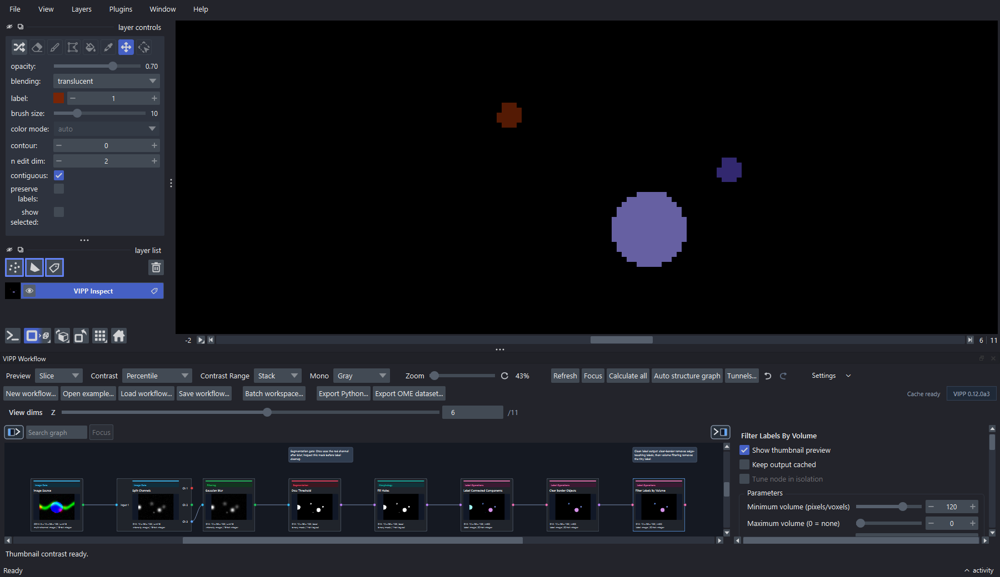

---
hide:
  - navigation
  - toc
---

  
  

Visual image processing pipelines for napari

# See every decision in your analysis

Build bioimage-analysis workflows as connected graphs, inspect intermediate images and tables, then save the workflow for review, adaptation, or batch processing.

[Start with a guided example](getting-started/index.md){ .md-button .md-button--primary }
[Find a workflow](workflows/index.md){ .md-button }

A complete label-cleanup graph shown in context. For day-to-day authoring, enlarge or undock VIPP so the graph remains the primary work surface.

!!! warning "Alpha release: validate before interpreting"
    The current public baseline is **napari-vipp 0.11.0a2**. Interfaces,
    workflow files, and parameter defaults may change between alpha releases.
    Treat visual inspection, reference data, and domain review as part of the
    analysis—not as optional cleanup after it.

## Choose your path

<a class="vipp-card" href="getting-started/"><strong>New to VIPP</strong>Install the plugin, tour a finished graph, and build a small segmentation workflow.</a>
<a class="vipp-card" href="workflows/"><strong>I have an analysis task</strong>Follow recipes for segmentation, measurements, networks, colocalization, restoration, or batch runs.</a>
<a class="vipp-card" href="scientific-practice/"><strong>I need defensible results</strong>Choose dimensionality, tune on representative data, validate, and record what must be reported.</a>
<a class="vipp-card" href="reference/"><strong>I know what I need</strong>Search all 108 nodes, bundled samples, example workflows, settings, formats, and compatibility notes.</a>

## What VIPP records—and what it does not

VIPP workflow JSON records the graph, node parameters, connections, layout,
and selected workflow state. Where available, image state carries axes, scale,
units, channel information, and operation history through compatible nodes.
This supports inspection and repeat execution, but it does **not** by itself
guarantee scientific reproducibility: input identity, software environment,
batch bindings, reference annotations, exclusions, and validation evidence must
also be retained.

## Quick links

| Goal | Go to |
| --- | --- |
| Open a working example in five minutes | [Tour a finished workflow](getting-started/example-tour.md) |
| Switch from synthetic data to your images | [Use your own images](getting-started/own-data.md) |
| Understand images, masks, labels, and tables | [Data types](concepts/data-types.md) |
| Diagnose a workflow that suddenly gives different counts | [Common problems](troubleshooting/common-pitfalls.md) |
| Ask a question or report a reproducible problem | [Support routes](troubleshooting/report-a-problem.md) |
| Prepare methods and provenance for a paper | [Report a VIPP analysis](scientific-practice/reporting.md) |
| Contribute a node or documentation fix | [Contributor guide](developer/index.md) |

The application is developed in the
[`napari-vipp` repository](https://github.com/rensutheart/napari-vipp). This
site is the quick, searchable manual; slower teaching material can live in a
separate course or book.
