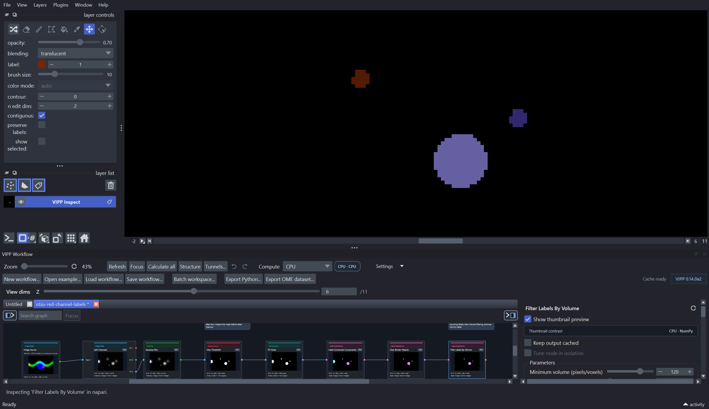

---
hide:
  - navigation
  - toc
---

  
  

VIPP — Visual Image Processing Platform

# See every decision in your analysis

Visual workflows for reproducible bioimage analysis.

Build bioimage-analysis workflows as connected graphs, inspect intermediate images and tables, then save the workflow for review, adaptation, or batch processing.

[Install VIPP](getting-started/installation.md){ .md-button .md-button--primary }
[Start with a guided example](getting-started/index.md){ .md-button }
[Find a workflow](workflows/index.md){ .md-button }

A complete label-cleanup graph shown in context. For day-to-day authoring, enlarge or undock VIPP so the graph remains the primary work surface.

!!! warning "Alpha release: validate before interpreting"
    This manual documents **napari-vipp 0.13.0a6**, distributed as an alpha
    pre-release through [GitHub](https://github.com/rensutheart/napari-vipp/releases/tag/v0.13.0a6)
    and [PyPI](https://pypi.org/project/napari-vipp/0.13.0a6/). Windows users
    should begin with the explicitly unsigned, checksum-verified installer;
    Linux, macOS, blocked Windows computers, and advanced users can use the
    version-pinned pip route. Exact release-source, CI, signing status,
    and release-verification status are recorded in the
    [release notes](releases/0.13.0a6.md#release-verification). The immutable
    commit, successful cross-platform CI run, explicit unsigned status, and
    qualified artifact hashes are recorded there. Confirm public GitHub/PyPI
    availability separately, and do not treat unperformed fresh-machine checks
    as passes. Interfaces, workflow files, and parameter defaults may change
    between alpha releases.
    Treat visual inspection, reference data, and domain review as part of the
    analysis—not as optional cleanup after it.

!!! important "0.13 workflow and compute compatibility"
    0.13.0a6 writes workflow schema 4. A valid schema-3 workflow loads with an
    explicit CPU compute request, while schemas 1 and 2 remain rejected. Cached
    results are not saved in workflow JSON and generated Python is pinned to
    its creator version. Read the
    [0.13.0a6 release notes](releases/0.13.0a6.md) before upgrading and
    revalidate calculated results afterward.

    Batch configs and manifests are version 3. Version-1 configs load with an
    explicit CPU request; version-2 configs keep their saved compute request.
    Both older versions have no source-axis declaration until reviewed and
    saved as version 3. For ordinary TIFF collections, review the Batch
    workspace's **Image stack** choice before treating generic pages as Z.

## Choose your path

<a class="vipp-card" href="getting-started/installation/"><strong>Install VIPP</strong>Verify and run the unsigned Windows alpha, or follow the pinned manual routes.</a>
<a class="vipp-card" href="getting-started/"><strong>New to VIPP</strong>Tour a finished graph and build a small segmentation workflow.</a>
<a class="vipp-card" href="workflows/"><strong>I have an analysis task</strong>Follow recipes for segmentation, measurements, networks, colocalization, restoration, or batch runs.</a>
<a class="vipp-card" href="how-to/choose-compute/"><strong>I want to use my GPU</strong>Install the optional stack, choose a compute policy, benchmark safely, and verify what actually ran.</a>
<a class="vipp-card" href="scientific-practice/"><strong>I need defensible results</strong>Choose dimensionality, tune on representative data, validate, and record what must be reported.</a>
<a class="vipp-card" href="reference/"><strong>I know what I need</strong>Search all 113 nodes, bundled samples, example workflows, settings, formats, and compatibility notes.</a>

## What VIPP records—and what it does not

VIPP workflow JSON records the graph, node parameters, connections, layout,
and selected workflow state. Where available, image state carries axes, scale,
units, channel information, and operation history through compatible nodes.
This supports inspection and repeat execution, but it does **not** by itself
guarantee scientific reproducibility: input identity, software environment,
batch bindings, reference annotations, exclusions, and validation evidence must
also be retained.

```mermaid
flowchart LR
  A["Load representative data"] --> B["Build and tune graph"]
  B --> C["Inspect intermediate outputs"]
  C --> D["Validate against references"]
  D --> E["Freeze workflow and environment"]
  E --> F["Run batch and audit outputs"]
```

## Quick links

| Goal | Go to |
| --- | --- |
| Open a working example in five minutes | [Tour a finished workflow](getting-started/example-tour.md) |
| Switch from synthetic data to your images | [Use your own images](getting-started/own-data.md) |
| Understand images, masks, labels, and tables | [Data types](concepts/data-types.md) |
| Diagnose a workflow that suddenly gives different counts | [Common problems](troubleshooting/common-pitfalls.md) |
| Ask a question or report a reproducible problem | [Support routes](troubleshooting/report-a-problem.md) |
| Prepare methods and provenance for a paper | [Report a VIPP analysis](scientific-practice/reporting.md) |
| Choose and verify CPU/GPU execution | [CPU and GPU compute](how-to/choose-compute.md) |
| Review everything changed in 0.13 | [0.13.0a6 release notes](releases/0.13.0a6.md) |
| Contribute a node or documentation fix | [Contributor guide](developer/index.md) |

The application is developed in the
[`napari-vipp` repository](https://github.com/rensutheart/napari-vipp). This
site is the quick, searchable manual; slower teaching material can live in a
separate course or book.
