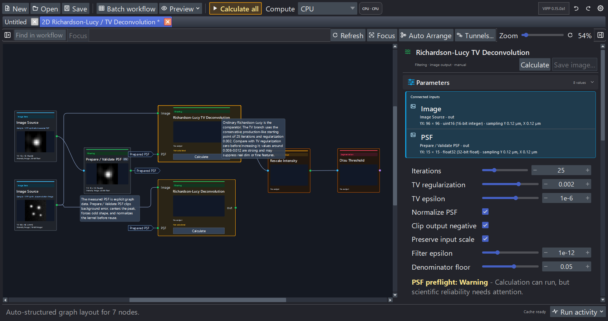

# Toolbar and settings

Labels below match napari-vipp 0.13.0a1. Controls can collapse into
**Settings** when the window is narrow.

## Workflow tabs

The movable tab bar holds independent live workflow sessions. Each tab retains
its graph, calculated results, ancillary caches, undo/redo history, inspector
state, file path, dirty baseline, display choices, compute request, and Batch
workspace. **New workflow…** and **Load workflow…** create sessions rather than
discarding another open graph. Tabs can be renamed, reordered, and closed with
Save/Discard/Cancel handling.

Switching tabs restores retained state and does not recalculate scientific
results. The selected tab is acknowledged immediately and can show an
indeterminate restoration state while its retained graph, inspector,
thumbnails, and caches are reattached; this is not a processing run. A
collection batch remains owned by its originating tab; VIPP blocks
closing that origin, launching a second batch, or closing the application until
the active run finishes or cooperatively cancels.

## Workflow toolbar

| Control | Effect |
| --- | --- |
| **New workflow…** | Create a new tab containing one unbound `Image Source` on an otherwise empty graph. |
| **Open example…** | Open one of 13 bundled templates; ordinary examples configure sample sources, while the batch example creates a safe working copy on request. |
| **Load workflow…** | Open an external or previously saved workflow JSON. A valid attached batch configuration restores and opens Batch workspace without running a preview. |
| **Save workflow…** | Save the active tab's graph structure, parameters, layout, portable compute request, and selected UI/display profiles—not computed arrays. When a Batch workspace is active, choose whether to attach its versioned configuration to the same workflow JSON. |
| **Batch workspace…** | Open or return to the retained local-collection setup, optional representative preview, run progress, final status, and provenance view. This is the sole Batch workspace entry and is visually separated between workflow loading and the export actions. |
| **Leave batch mode** | When a retained representative session exists, discard its transient collection source overrides and return that workflow tab to ordinary single-image mode. It is unavailable during an active batch run. |
| **Export Python…** | Generate a headless script using supported operation and I/O calls. |
| **Export OME dataset…** | Save one reference image with associated graph label outputs. |
| **Tunnels…** | Manage named graph outputs and subscribers. |
| **Auto structure graph** | Apply a one-shot source-to-sink layout; undo restores positions. |
| **Focus** | Recover the graph center without changing zoom, selection, layout, cache state, or undo history. |
| **Refresh** | Re-evaluate ordinary automatic graph state. |
| **Calculate all** | Calculate manual nodes that are not current. During isolated tuning, first apply the tuned result and release the temporary downstream boundary. |
| **Undo / Redo** | Reverse or restore supported workflow edits. |

Image Source cards display the live layer, sample, file, or collection binding
in an elided subtitle and retain the complete value in a tooltip. A compatible
node dropped onto an existing wire can split that connection in place. Named
output tunnels can be rerouted by dragging their source badge to another
compatible output; preview/commit share type, cycle, and topology validation,
and the accepted edit is atomic and undoable.

## Compute controls

| Control | Effect |
| --- | --- |
| **CPU / Auto / Prefer GPU / Selective** | CPU forces authoritative host implementations. Auto is the conservative default; ordinary UI/batch/generated runs in this alpha supply no local timing evidence, so fresh Auto candidates remain CPU. Prefer GPU uses every reviewed eligible public GPU candidate without requiring a CPU-speed win. Selective exposes authored per-node CPU/GPU choices and benchmarking. |
| Actual-run compute summary | After an accepted run, summarizes the CPU/GPU mix or fallback state; hover for why the run made those decisions. |
| **Find fastest pipeline…** | In Selective mode, benchmark scientifically eligible implementations for unlocked nodes, validate a proposed whole-pipeline assignment, and present it for review before applying. |
| **Strict selective GPU choices** | Fail when an explicitly selected GPU implementation is unavailable or ineligible for the exact call/memory plan instead of using a fallback-safe visible CPU decision. A non-fallback-safe rejection fails under either policy. |
| **Compute setup and memory…** | Verify the optional GPU stack, show typed eligibility/repair guidance, and inspect host RAM plus discrete VRAM or unified memory where supported. |

New sessions default to **Auto**. A schema-3 workflow loads as **CPU** because
the old file did not author compute intent. Auto never benchmarks during a
calculation. Because the standard interactive, saved-batch, and generated paths
do not attach performance evidence in 0.13.0a1, fresh Auto calls resolve to CPU;
programmatic callers can provide validated evidence explicitly. To run GPU from
the normal interface, use **Prefer GPU** for global accelerator placement or a
reviewed Selective provider/**Find fastest** proposal for per-node control.

Prefer GPU bypasses only Auto's CPU-versus-GPU performance gate. Scientific,
dtype, parameter, dependency, environment, and memory admission remain active,
and unsupported nodes receive an explained ordinary CPU decision. Prefer GPU
requires visible fallback. If every eligible GPU has complete comparable timing
evidence, VIPP chooses the fastest GPU; otherwise stable implementation-ID order
provides a deterministic choice without making a speed claim. Per-node
preferences and both benchmark actions are inactive until Selective is restored.

In Selective mode, an operation with a declared provider shows **Follow pipeline
policy**, **CPU**, and one **GPU · library** entry for each declared library.
The choice remains visible even when the current call or environment will later
be rejected, fall back, or fail; execution admission is call-specific. **Best
GPU** appears only when several libraries genuinely compete. Exact
implementation pins are an advanced persistence/API feature; a loaded pin
remains visible until deliberately replaced. A separate optimizer lock—not
merely choosing a backend—preserves a node during **Find fastest**.

Calculated cards show compact **CPU**, **GPU · CuPy**, **GPU · cuCIM**, or amber
**CPU fallback** badges. A muted badge belongs to the last accepted run while a
new result is pending. Hover or inspect the node for the implementation ID and
version, runtime/device, preference, decision reason, benchmark evidence,
memory estimate, and fallback details.

Node benchmarking and whole-pipeline optimization use the exact current inputs
and require scientific parity before timing alternatives. CPU timing uses
paired warm medians; GPU timing distinguishes resident compute from transfers
modeled across the complete pipeline. The optimizer reports overall and
current-operation progress. A monolithic library call can remain at one
percentage until it returns; a reached time limit means comparisons remain, not
that the current graph was proved optimal. Completed exact benchmark records
are reused on retry.

For the practical sequence, first-release GPU-region summary, dtype caveats,
and platform/install boundary, see
[choose and verify CPU or GPU compute](../how-to/choose-compute.md).

## Feedback surfaces

VIPP uses one severity-aware message strip for workflow, graph, source, compute,
and batch feedback. Routine information and warnings remain lightweight; only
an actionable error uses a filled, full-width alert. A message is not the
execution record: the toolbar actual-run summary and per-node badges carry the
compact compute result, while the detailed execution/provenance view explains
implementation and fallback decisions.

Napari's status bar at the bottom of the viewer is separate. It belongs to the
viewer and reports coordinates, values, and layer interaction; VIPP does not
duplicate that purpose in its message strip.

## Display settings

| Setting | Choices / meaning |
| --- | --- |
| Preview mode | `Slice`, `MIP`, or `Off` for graph/inspector previews. |
| Thumbnail contrast | Controls thumbnail contrast behavior; it does not alter processed data. |
| Contrast range | Controls how contrast scope is estimated. |
| Monochrome colormap | Changes display of monochrome previews only. |
| Link napari/VIPP sliders | Synchronizes napari dimensions and VIPP preview sliders. |
| Save thumbnail visibility in workflows | Includes per-node thumbnail visibility in workflow UI state. |
| Port labels | `Ambiguous only` (default) labels multi-input or multi-output nodes, `Show all` labels every port, and `Hide all` removes persistent labels. |
| Graph zoom | Scales graph cards; reset returns to 100%. |

Long port names are shortened on the card and retain their full text in a
tooltip. Changing the label mode can make an already tightly packed layout
overlap; VIPP reports the number of overlapping card pairs in its message strip.
Use **Auto structure graph** to make label-aware space, or move the affected
cards manually. Label visibility is a graph-display choice and never changes
connections or processed data.

## Execution and memory settings

| Setting | Meaning |
| --- | --- |
| Run all in BG | Checked: dispatch every graph recompute to background processing. Unchecked: use adaptive execution, keeping small ordinary work immediate while backgrounding known expensive operations and large inputs. |
| Cache mode | Keep all outputs, use Smart interactive cache, or use Low-memory mode. |
| Auto memory guard | Switches away from keep-all and prunes optional outputs if the configured cache share is exceeded. |
| Cache limit | Share of free-or-reclaimable memory used by the keep-all cache before the guard acts. |
| Keep output cached | Per-node request to retain an important result in Smart/Low-memory modes. |
| Auto Recalculate | Re-runs a selected manual node when upstream state changes; use cautiously for expensive work. |

Host cache status reports RAM. **Compute setup and memory…** adds accelerator
memory: discrete NVIDIA devices report separate VRAM, while a future unified-
memory provider must report the shared budget rather than double-counting it.
The executor applies an operation-specific conservative memory estimate before
device work; the estimate and any typed OOM/fallback are part of execution
provenance.

**Cancel** prevents queued reruns and ignores the active result. It asks
cooperative work to stop, but cannot forcibly interrupt every NumPy, SciPy, or
scikit-image, CuPy, or cuCIM call already executing. GPU progress advances only
after synchronization at a truthful operation checkpoint, and cancellation
waits for cleanup before a result can be published.

The current adaptive large-input boundary is 4,000,000 elements or 32 MiB,
whichever is reached first. This applies even when **Run all in BG** is
unchecked. Exact threshold diagnostics, Auto Contrast, colocalization density,
and generated-layer contrast calculations also leave the user-interface thread
when their inputs are large.

Background execution changes *where* work runs, not the method or the values it
uses. Exact operations still inspect the complete required population. They may
consume CPU time and memory while napari remains responsive.

### Tune one node in isolation

**Tune node in isolation** is available in the selected-node inspector and the
node context menu. The selected node must have a coherent cached result, and no
dirty edit, pipeline calculation, source load, or batch run can be pending or
in flight. Downstream nodes do not all need to have outputs.

While the session is active, parameter edits recalculate the selected node but
pause propagation beyond it. The tuned node is the bright-amber actionable
frontier. Its downstream closure is darker amber and labelled as waiting; those
cards keep their last coherent results when they have them and otherwise remain
unavailable. Neither case may be interpreted as a result of the new parameter
values.

- **Apply and continue** keeps the latest parameters and local result, releases
  the boundary, and resumes calculation from the node's direct descendants.
- **Cancel tuning** restores the parameters, output, and execution state that
  were current when the session began without recalculating the held branch.
- **Calculate all** applies the current tuning result before performing its
  ordinary automatic and manual-node scheduling.

Only one node can be isolated at a time. A graph, layout, note, workflow-load,
undo/redo, or other history-backed edit first commits the current tuning result,
so cancellation cannot cross graph revisions. The isolation boundary and its
restoration snapshot are transient session state; they are not written to
workflow JSON.

## Inspector surfaces

Depending on the selected node/output, the inspector can show parameters,
execution state, output metadata/history, output and input histograms, label
volume distribution, colocalization scatter, table preview, auto contrast,
**Pin selected**, **Save selected output…**, and an explicit reset of the
selected output's remembered display profile.

### Numeric parameter entry

Numeric spinners accept direct keyboard entry as well as their step buttons and
paired sliders. Floating-point fields accept decimal points or commas and
scientific notation such as `2e-4`; sufficiently small non-zero values are also
displayed in scientific notation. A slider is an exploration window, not
necessarily the full valid entry range. Right-click a numeric field and choose
**Reset to default** to restore that operation's declared default.

### Manual execution colors

Manual/cached execution barriers apply to every VIPP operation that uses the
manual policy, including measurements, graph analysis, colocalization, and
deconvolution.

| Graph color | Meaning | Action |
| --- | --- | --- |
| Bright amber | This is the first manual node stopping the branch. It has never been calculated, or its cached result is stale. | Select this node and choose **Calculate** or **Recalculate**, or use **Calculate all**. |
| Dark amber | This downstream node is also stale, but it is waiting for the bright-amber upstream barrier. VIPP retains its last coherent cached result when one exists; otherwise it remains unavailable. | Resolve the bright-amber node first; this node will then run or become the next actionable barrier. |

*The two deconvolution branches are actionable. Rescale Intensity and Otsu
Threshold wait behind the selected RL-TV branch and are not the source of the
problem.*

The toolbar **Calculate all** button also turns bright amber while an
uncalculated or stale manual frontier needs attention. It returns to the normal
toolbar style when no such action remains. A node already configured for
**Auto Recalculate** does not trigger this user-action prompt while VIPP is
handling it automatically.

This distinction also applies during background execution. A dark-amber node
does not show a processing spinner until it is actually runnable. Once that
node finishes updating, it returns to its normal current color immediately
while later nodes continue calculating; it does not remain dark amber until the
whole branch finishes. Every completed card receives a run-scoped execution
state and sampled thumbnail. Selecting, pinning, or inspecting tables and
metadata uses the same newly completed run-scoped payload when the active cache
policy already retains that node. Low-memory pruning remains in force for other
intermediates, which follow the normal cache-restore behavior when selected.
VIPP still commits the scientific workflow cache only after accepting the
complete background run. Cancelling, superseding, or editing during a run
discards these temporary presentation updates and restores the last coherent
cache view.

### The active VIPP Inspect layer

When the same logical node/output recalculates with a compatible active VIPP
**Inspect** `Image` presentation, VIPP reuses the existing layer object and
replaces only its data reference. The new reference exposes the exact
underlying pixels as a non-writeable view. VIPP preserves displayed dimensions
and slice positions, camera zoom/translation/rotation, and compatible styling
such as colormap, contrast, blending, opacity, visibility, gamma,
interpolation, and compatible rendering settings. Layer scale is reapplied
from output metadata; arbitrary napari transforms are not saved in a display
profile. Isolated tuning therefore remains on the same viewed region. Pinned
layers are separate viewer artifacts and do not receive this saved per-output
profile behavior.

VIPP remembers presentation independently by node, output port, and RGB
surface and saves those profiles as workflow UI state. Switching to a different
logical output restores that output's profile or initializes safe defaults;
the previous output's styling cannot leak across the switch. Use the inspector
header reset action to return the selected output deliberately to defaults.

VIPP replaces the layer for a genuine presentation-class change, such as
`Image` to `Labels`, or for an incompatible RGB layout. A Boolean mask pinned
as a napari `Labels` overlay requires a uint8 presentation copy. That conversion
is limited to the class-changing display path and is not written back to the
node output: the scientific cache, saved output, and downstream calculations
retain the original exact array.

## Auto Contrast Versus Display Contrast

**Auto Contrast** appears for `Linear Scale + Offset`. It calculates exact
full-input finite percentiles from the chosen saturation setting and writes the
resulting `alpha` and `beta` into the node. It therefore changes workflow data.

The contrast limits on inspect and pinned napari layers are display-only. Large
layers can briefly use an explicit provisional dtype range while VIPP obtains
the exact full finite range in the background. A manual napari contrast edit
made during that calculation is preserved. Neither the provisional nor final
layer contrast changes downstream arrays, masks, thresholds, or measurements.

The histogram panel is also a display summary. It counts every finite value,
but its chart bins are independent of a floating-point automatic-threshold
node's saved **Float histogram bins** parameter.

## Draggable histogram guides

Input-histogram markers for Binary Threshold, Hysteresis Threshold, explicit
Rescale Intensity/Clip cutoffs, and supported colocalization thresholds are
editable by dragging. A pointer click without movement does not change the
parameter.

Rescale Intensity has two draggable guides. Moving a percentile-derived guide
switches the node to **Explicit values**, preserves the other exact cutoff, and
queues interactive recalculation. This is a scientific parameter edit: save
the workflow after accepting it. VIPP reuses unchanged input counts while a
manual marker moves and refreshes the output histogram after the output changes.

## Colocalization scatter controls

The inspector scatter and resizable pop-out share a two-way linked colormap
selector. Redrawing from the cached threshold-independent density does not
change channels, ROI, thresholds, counts, or tables. Threshold scrubbing moves
the guides immediately, marks the old exact count as calculating, coalesces
rapid requests, and recounts the complete ROI before publishing a new value.

Interactive density is capped and reported at 1,024 bins per axis to keep the
viewer responsive. `Colocalization Scatter Plot` and its masked variant are
ordinary graph nodes with independently configurable bins and square output
size up to 4,096, native populated axis ranges, optional symmetric percentile
clipping, and memory-bounded masked accumulation. The pop-out saves PNG or TIFF
at its current display resolution; use a graph node when the scatter image must
be part of the durable workflow.

## Batch representative strip

After a successful batch preview, a persistent strip above the graph exposes
Previous/Next, a full-plan slider, item position, batch ID, and every paired
filename. It calculates one representative only and never saves batch outputs.
The requested item is labelled as current only after all matching sources load
and the graph calculation succeeds. The strip does not duplicate the main
**Batch workspace…** action; use the sole toolbar button to reopen the retained
workspace. **Leave batch mode** discards these transient representative source
overrides and returns the tab to ordinary single-image use; it is disabled
during a run. See [process a folder](../workflows/batch-processing.md).
