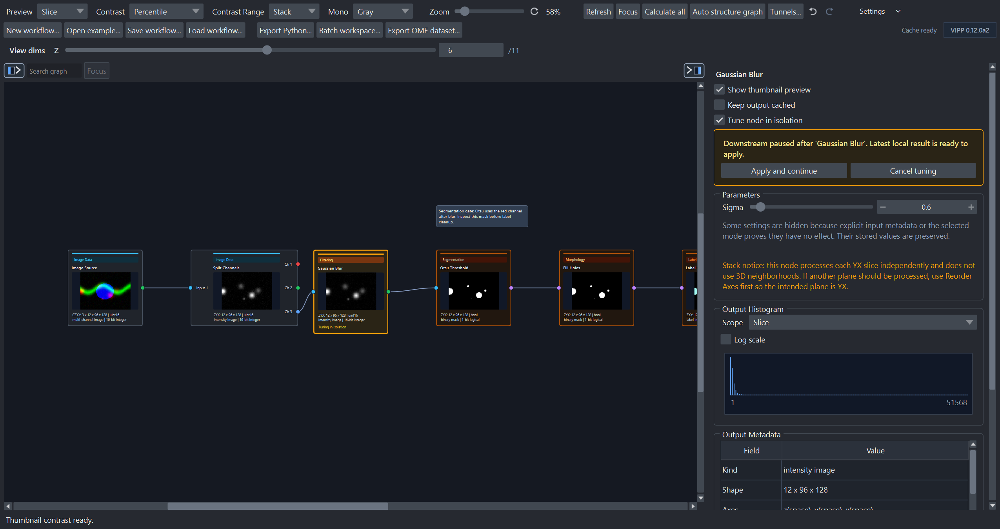
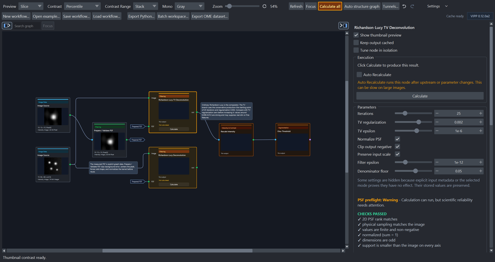

# VIPP 0.12.0a2

**Release date:** 16 July 2026

**Maturity:** Alpha pre-release

VIPP 0.12.0a2 makes expensive interactive workflows easier to tune and trust.
It adds isolated node tuning, clearer actionable-versus-waiting execution
states, progressive run-scoped previews, faster exact-pixel presentation,
graph port-label controls, and more legible PSF/deconvolution guidance.

!!! important "Workflow schema remains 3"

    This release does **not** increment the workflow schema. A valid schema-3
    workflow from 0.12.0a1 loads structurally in 0.12.0a2. Workflow JSON does
    not contain cached scientific pixels or tables, so recalculate and validate
    after upgrading. Schema versions 1 and 2 remain rejected.

    Generated Python is a separate artifact: it records the exact VIPP version
    that created it and refuses another runtime. Regenerate and revalidate every
    export under 0.12.0a2.

## Highlights

- Tune one node repeatedly while keeping every downstream node paused and any
  previously calculated downstream output available.
- Distinguish a bright-amber node that needs action from dark-amber downstream
  nodes that are waiting for it.
- See each completed node's new thumbnail and ready state while a background
  run continues through the rest of the graph.
- Switch compatible image previews without copying the complete scientific
  volume, while preserving the exact cached pixels.
- Choose ambiguous-only, all, or hidden graph port labels.
- Read PSF checks as passed items, attention items, and next actions, with
  sampling, support, and boundary questions kept distinct.

## Before upgrading from 0.12.0a1

1. Preserve the original workflow, environment, inputs, outputs, and validation
   evidence.
2. Open a duplicate schema-3 workflow in 0.12.0a2 and inspect its structure,
   parameters, sources, connections, and dynamic ports.
3. Recalculate the graph. Cached results are not serialized in workflow JSON.
4. Compare decisive intermediates and final measurements with the validated
   0.12.0a1 results or other reference data.
5. Regenerate exported Python and rerun its validation under 0.12.0a2.
6. Preview and review batch plans again before consequential execution.

See [versions and compatibility](../reference/versioning.md), the
[workflow contract](../reference/workflow-contract.md), and
[validation status](../reference/validation-status.md).

## Isolated node tuning

**Tune node in isolation** is available from the node context menu and at the
top of the inspector. The selected node must have a coherent cached result and
no dirty edit, pipeline calculation, source load, or batch run may be pending
or in flight. Descendants do not all need to have outputs. The command creates
a persistent **Downstream paused** session:

- editing parameters recalculates only the tuned node;
- the tuned node remains the bright-amber actionable frontier while it needs
  calculation;
- downstream nodes remain dark amber and keep their last coherent cached
  outputs when those exist; otherwise they remain unavailable until the tuned
  result is accepted;
- **Apply and continue** reuses the latest tuned output and resumes from the
  direct children; and
- **Cancel tuning** restores the session-start parameters and cached result.

**Calculate all** releases isolated tuning before normal execution, including
for fully automatic graphs. Applying stops a pending parameter debounce so it
cannot trigger a duplicate run. Graph and history edits safely commit the
active tuning session before changing the saved workflow. The isolation
boundary is shared by synchronous and detached execution but is transient: it
is not written to workflow JSON.

## Execution feedback and progressive results

Manual nodes that have never been calculated now use the same bright-amber
action styling as stale manual barriers. **Calculate all** also turns amber
when an uncalculated or stale manual frontier needs attention.

Every stale manual/cached node acts as an execution barrier across VIPP. The
actionable barrier is bright amber; stale descendants are dark amber, retain
their last coherent cached outputs when those exist, and resume in dependency
order after the barrier is recalculated. A descendant with no prior output
remains unavailable while it waits. During a background run, each completed
downstream node leaves that waiting state as soon as its result is available
instead of waiting for the entire branch.

Each completed node also publishes a run-scoped thumbnail immediately. The
first preview uses the exact completed pixels with scan-free display limits.
These partial worker results do not enter the live scientific cache: VIPP
accepts the complete run atomically, and ignores previews from stale run or
source revisions.

## Faster exact-pixel presentation

Inspector, pinned-label, and RGB-channel layers now use exact, non-writeable
views of cached arrays instead of copying complete volumes for display. Boolean
masks are converted only when a napari Labels layer requires an integer
representation.

Compatible napari Image layers are reused across image/mask dtype changes and
same-rank shape changes. VIPP explicitly resets mask blending, colormap, and
contrast properties when returning to a normal image. It still replaces the
layer when the presentation class genuinely changes, such as Image versus
Labels, incompatible rank, RGB layout, or channel layout.

Reused layers invalidate stale contrast tokens. Rapid node selection rejects
contrast or histogram results that belong to a previously selected output.
Thumbnail inputs are reduced to display resolution before rendering, while
exact stack contrast remains a background calculation and the shared progress
area stays visible through post-pipeline presentation work.

Rescale Intensity now reports cutoff and voxel-processing phases. Floating-point
rescaling uses bounded float64 work chunks with unchanged output arithmetic,
and exact 0/100-percentile cutoffs use direct finite extrema rather than an
unnecessary order statistic.

## Graph port labels

**Settings → Port labels** provides three modes:

- **Ambiguous only** (default) labels ports where a wire is not self-explanatory;
- **Show all** labels every port; and
- **Hide all** removes port labels.

Visible labels reserve horizontal gutters, multi-port rows reserve vertical
space, and long names are elided with the full name in a tooltip. Changing the
mode resizes cards without moving manually arranged nodes. If that introduces
overlap, VIPP points to **Auto structure graph**, whose layout uses the expanded
card dimensions.

## PSF and deconvolution guidance

Born-Wolf support controls now identify their user-set physical spans. PSF
preflight separates three different questions instead of presenting one block
of orange text:

1. whether physical sampling meets a conventional widefield Nyquist estimate;
2. whether the fixed support window contains the PSF tail; and
3. how PSF support compares with the image extent under the current
   zero-outside-image boundary assumption.

Passed checks, attention items, and next actions have separate presentation.
Support warnings name the affected axis and the PSF/image sample counts;
boundary intensity is distinguished from intensity outside the array; and the
inspector explains that **Prepare / Validate PSF** does not resize support.
Boundary-tail mass is reported by Z, Y, and X.

A kernel as large as or larger than an image axis can still calculate. When the
support equals the image size, the fully supported region is reduced to one
centered output position on that axis; when the support is larger, no output
position has full PSF support. Wrong rank and metadata-known sampling mismatch
remain hard failures. Missing physical calibration is a warning because
sampling compatibility cannot be verified; VIPP does not replace it with
invented unit spacing. The diagnostic does not silently recenter, crop, pad,
normalize, or resample the PSF.

Richardson-Lucy and Richardson-Lucy TV inspectors now reserve enough space for
wrapped guidance and keep long preflight notes available through normal
scrolling. Float fields use compact scientific notation for small non-zero
values, and numeric fields retain their standard edit menu while adding
**Reset to default**. RL-TV guidance also calls out under-convergence, feature
loss from excessive TV, and the need to validate the PSF before tuning
regularization.

The bundled 2D and 3D RL-TV comparisons now use 25 iterations, TV
regularization `0.002`, and denominator floor `0.05`. Values around
`0.008–0.012` are identified as comparatively strong rather than as a default
recommendation. Reconstruction mathematics, constant initialization, boundary
handling, numerical-guard defaults, and the `0.002` TV default are otherwise
unchanged.

## Compatibility and validation boundary

0.12.0a2 is primarily an interaction, presentation, and execution-feedback
release built on the 0.12.0a1 scientific architecture. Workflow schema remains
3 and scientific cache publication remains atomic. Structural compatibility
does not establish numerical equivalence, assay validity, or restoration
quality. Revalidate representative and held-out data before relying on an
upgraded workflow, especially for deconvolution and large-data paths.

VIPP remains alpha software. The public
[validation-status page](../reference/validation-status.md) separates current
automated/synthetic evidence from real-image, performance, interoperability,
and usability evidence still required.
