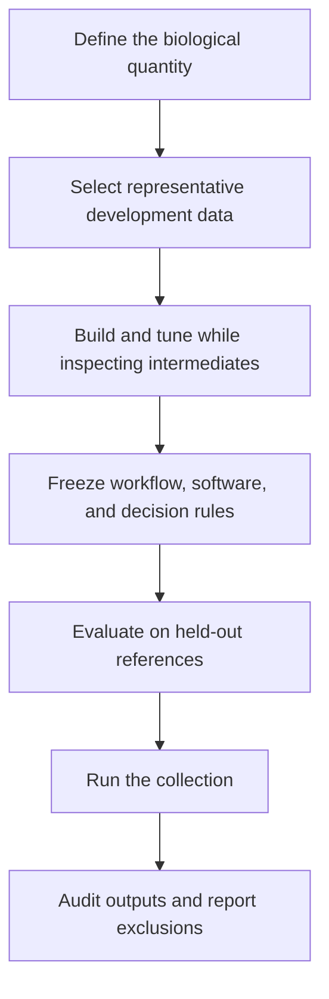

# Scientific practice

VIPP makes intermediate outputs easier to see; it cannot decide whether those
outputs answer a biological question correctly. A defensible workflow combines
visible processing with representative data, independent references, and a
frozen evaluation procedure.

## Minimum analysis lifecycle

## Four questions to ask

1. **What is the target?** A nucleus, punctum, branch, event, overlap, or
   intensity summary needs an operational definition.
2. **What can vary?** Include acquisition day, operator, treatment, tissue,
   signal level, artifact, and biological heterogeneity in representative data.
3. **What is independent evidence?** Reference annotations, calibrated phantoms,
   known synthetic truth, or a justified external method should not be the same
   output used to tune the workflow.
4. **What would make the workflow fail?** Predefine failure/QC criteria before
   seeing all experimental results.

## Continue by decision

- [Choose 2D or 3D](choosing-dimensionality.md) before building spatial nodes.
- [Tune without fooling yourself](parameter-tuning.md) before a parameter sweep.
- [Validate a workflow](validation.md) before drawing biological conclusions.
- [Report a VIPP analysis](reporting.md) before sharing or publishing.

!!! danger "Inspection is necessary, not sufficient"
    A plausible overlay can still be biased, inconsistent, or wrong outside the
    inspected field. Conversely, a strong aggregate metric can hide systematic
    boundary errors. Use visual and quantitative evidence together.
