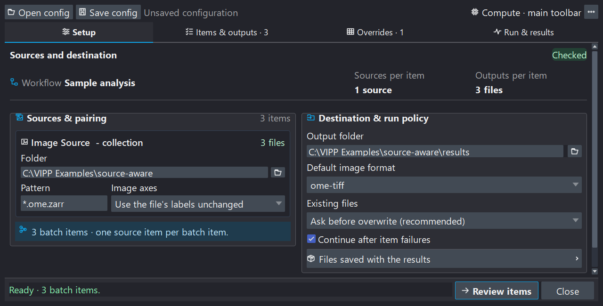
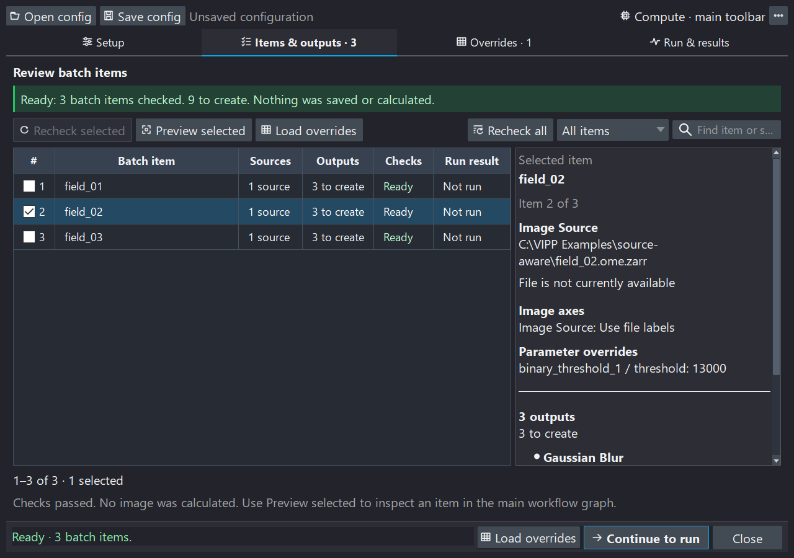
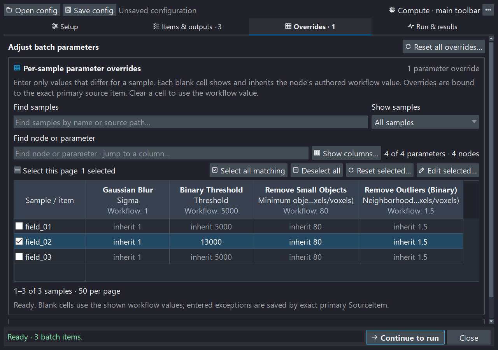
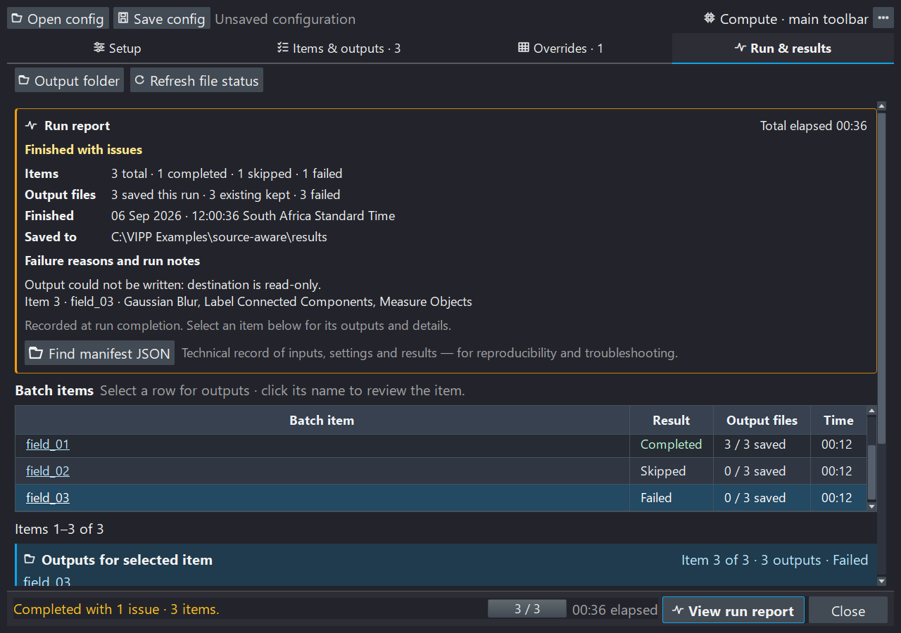

# Process a folder

Use **Batch** in the main workflow toolbar to apply one reviewed workflow to
collections of local images. The **Batch workflow** window separates preparation
from processing: checking files does not calculate images, and previewing one
sample does not run the collection.

| Tab | What to do here |
| --- | --- |
| **Setup** | Choose source folders, pairing, destination, image format, and run policy. |
| **Items & outputs** | Review the exact samples and outputs, inspect a representative, and decide what to do with existing files. |
| **Overrides** | Change supported numeric values for particular samples, or Run/Bypass behavior for every sample. |
| **Run & results** | Review the final plan, run it, and read the results and failure explanations. |

The footer keeps the current activity and next action visible. You can return to
an earlier tab without starting a check or a run merely by opening that tab.

## 1. Set up sources and destination

Start with a workflow that you have already validated on representative data.
Add an explicit `Batch Output` node for each image, mask, label image, RGB image,
or table you want to save. Open **Batch**, then in **Setup**:

1. Bind each varying `Image Source` to a folder and filename pattern.
2. Review the **Image axes** choice. Use file labels unless the acquisition
   requires a deliberate interpretation; see [TIFF pages and axes](#tell-vipp-what-tiff-pages-mean).
3. Choose the output folder and default image format.
4. Choose the existing-file policy and whether to continue after an item fails.
5. Review the compute request. It describes the requested policy, not proof that
   a GPU will be used; actual implementations are recorded with the run.
6. Select **Check batch**.



*Setup makes source bindings and output policy visible before processing. These
interface examples use three synthetic fields and image/table outputs, not
research data. The paired Red/Green walkthrough below is a separate bundled demo.*

The suggested `output` subfolder of the primary source is only a suggestion.
Review and confirm it. With recursive input patterns such as `**/*.tif`, choose
a destination outside the input tree so a future search cannot include results
from an earlier run.

### Why checking can take time

The first stage lists filenames and opens **Items & outputs** quickly. VIPP then
reads image metadata and verifies exact source content in the background. Follow
the active-file indicator and checked-file count. Content fingerprints read the
source bytes, so a large CZI or TIFF can take substantially longer than listing
its name.

One file may contain several image series. The initial file inventory is not
yet the final sample list; wait for checking to finish before previewing, editing
sample overrides, or running. Check does not calculate workflow images or save
processing outputs.

### Deterministic pairing

VIPP sorts matched paths independently for every bound source, expands
inspectable containers into source items, and pairs those items by position.
Every bound source must produce the same number of items.

```text
Red source:   field_01.npy  field_02.npy  field_03.npy
Green source: field_01.npy  field_02.npy  field_03.npy
Batch items:  (Red 01, Green 01), (Red 02, Green 02), (Red 03, Green 03)
```

Filename similarity does not establish biological pairing. Compare the list
with an independent sample map. Time, channel, and Z remain axes inside an item;
VIPP does not automatically iterate axis combinations or discover HCS
plate/well/field structure.

Each resolved `SourceItem` includes a stable selector, the observed container
revision, and reader evidence. Changed sources, missing companions, or changed
series topology require review instead of silently reassigning an old override
to a different sample. Fixed file-backed sources can remain unbound; live napari
layers and bundled sample sources need file collection bindings for headless
batch execution.

### Tell VIPP what TIFF pages mean

For a new source, **Automatic (recommended)** can suggest a Z stack in one
narrow case: an ordinary TIFF reports exactly `QYX`, and the workflow proves
that it needs `ZYX`. VIPP visibly selects **Stack planes are depth slices
(Z stack)** and retries the check once. Confirm that those pages genuinely are
depth slices. Choose **Use the file's labels unchanged** to opt out.

The accepted decision is saved as `QYX -> ZYX`. Every item must match the
declared original axes and rank. This renames axes without moving pixels;
`Reorder Axes` instead transposes data and metadata. Neither action discovers
the physical slice spacing. Review scale and units separately.

Automatic is a conservative GUI convenience, not a headless guess. Saving
without a needed suggestion records no declaration. **Something else
(advanced)…** exposes less common explicit interpretations.

## 2. Review items and outputs

Click a row to read its sources, image axes, parameter exceptions, and outputs.
The output list emphasizes **what will be saved**—the producing node, data kind,
and format. Use **Show file paths** when exact filenames matter. **Find in File
Explorer** or **Find in Finder** reveals an existing file; Linux opens its
containing folder.



*The highlighted row controls the details panel. Checkboxes independently select
samples for actions, so selecting a row need not navigate away from the list.*

Search and filter the list before selecting samples. Checkboxes choose samples
for multi-item actions; the highlighted row determines the details being shown.
The list uses 50-row pages, and selections can include samples on another page.

**Recheck selected** verifies the chosen source revisions and output presence;
it does not replace full scientific preflight for the whole collection. Use
**Recheck all** after a scientific setting or source-definition change.
**Load overrides** opens the selected samples in the override editor—it is not
an import-file action.

### Preview one sample

**Preview selected** calculates the chosen item through the live graph, including
its effective parameter and node overrides. It does not write batch outputs.
The **Batch representative** strip above the graph lets you move between samples
and return to the current item in the Batch workflow window to inspect its
details or load its overrides.

Representative selection replaces all collection-bound sources together; fixed
sources remain fixed. The authored workflow defaults do not change. A requested
representative becomes the displayed item only after its source loading and
calculation succeed. **Leave batch** returns to ordinary single-image work
without deleting files or saved configurations.

### Keep some existing files and overwrite others

The **Existing files · batch default** control is available in both
**Items & outputs** and **Run & results**. You do not need to return to Setup
or repeat the full source check just to change this policy.

| Choice | Meaning |
| --- | --- |
| **Ask before overwrite** | Existing destinations need a decision. Pressing Run presents the overwrite review; no replacement occurs before explicit consent. Headless execution cannot ask and fails closed. |
| **Skip existing** | Keep each existing output unchanged; create missing outputs. |
| **Overwrite without asking** | Permit replacement when the batch is explicitly run. |

For an individual exception, **right-click that item's row** and choose:

- **Keep existing outputs**;
- **Rerun and overwrite outputs**; or
- **Use batch default** to remove its exception.

These actions affect the clicked item, not every checked row. **Reset item
choices** removes all individual file-policy exceptions; it does not reset
scientific parameter or node overrides. Choices survive save/load and changes
to the default, and are bound to exact source identities and destination paths.

An item whose outputs will all be kept needs no source-pixel calculation.
If only some outputs exist, it can still calculate once to create the missing
ones. The run count excludes fully kept items; existing files are not relabelled
as newly saved results. Keeping files does not prove that an earlier analysis
finished successfully or used the current workflow.

Duplicate output destinations, outputs overlapping inputs, and explicitly
protected outputs remain errors. An item-level overwrite choice cannot bypass
those protections. Final Run validation still checks current disk state.

## 3. Review overrides

### Per-sample parameter overrides

Rows are samples and columns are eligible numeric scientific parameters. The
node name identifies the column; the displayed workflow value is its inherited
default. Leave a cell blank to inherit that value, or enter an exception.



*Parameter exceptions belong to individual samples. Run/Bypass choices below
apply to the entire batch; neither edits the authored workflow defaults.*

Use **Find samples**, **Show samples**, and **Find node or parameter** to narrow
the view. **Show columns…** controls which parameters are visible; hiding a
column does not delete its values.

For several samples, check their rows and choose **Edit selected…**. First choose
the parameters to change, then choose **Set value** or **Use workflow value**
for each. **Apply to selected samples** commits the validated draft.
**Discard edits** changes nothing. Unchosen parameters retain their existing
overrides.

The selection and reset controls have different jobs:

- **Select this page** changes checkboxes on the visible page.
- **Select all matching** selects every sample matching the filters, including
  other pages. Check the selected count before applying an edit.
- **Deselect all** only removes selection; no parameter values change.
- **Reset selected…** restores all parameter defaults for checked samples,
  including hidden columns and selected samples on other pages.
- **Reset all overrides…** restores all sample parameters **and** all batch
  Run/Bypass choices. It does not change the original workflow.

Resets ask for confirmation. Numeric overrides use the normal parameter bounds
and types. Choice settings, source selectors, destinations, compute controls,
expressions, and graph topology are not per-sample parameters.

### Run or bypass nodes

Expand **Run or bypass nodes**, the second section of Overrides. Its choices
apply to **every sample**: inherit the workflow, force Run, or force Bypass.
Explicit Run and Bypass choices use distinct highlighting so exceptions are
easy to find. Bypass forwards a compatible primary input without applying the
operation; unsafe splices are rejected. The authored graph stays unchanged.

Parameter or node changes make the scientific plan stale. Use the warning's
**Check batch** action, or **Recheck all**, before running. A representative
preview is useful for visual review but is not required to run a checked batch.

## 4. Run and read the report

Review the destination, sample and output counts, effective existing-file policy,
and overrides in **Run & results**, then press the Run button. VIPP performs
**one final collection validation** to detect disk changes since Check. Its
worker reuses that fresh plan; it does not repeat the same collection discovery
as a second preparation phase. Full-content fingerprints and large containers
can still make this preparation take time.

If sources or the reviewed plan changed unexpectedly, VIPP stops for review.
Per-item source verification and guarded publication remain active during
processing. A checked plan is not permission to use subsequently changed files.

The upper progress bar reports the sample, status, and current node number, for
example **Running (node 12/32)**. The lower bar reports the friendly node name
and operation checkpoint. Elapsed time is shown separately. A long atomic
library or file-writer call may not report intermediate percentages; VIPP does
not invent progress inside that call.

### Stop safely

**Stop safely** requests cooperative cancellation. The current library call may
finish before cancellation is observed. Wait for finalization and cleanup;
**Hide window** does not cancel a run. Completed earlier outputs remain saved.
An item interrupted before publication is distinguished from an item that
failed; later unstarted items are recorded separately as skipped.

There is no automatic resume button. To continue deliberately, return to Setup,
review settings, check again, and choose which existing outputs to keep or
overwrite. “Skip existing” preserves files; it is not a guarantee that unfinished
work from an earlier item resumes exactly where it stopped.

### The readable run report

The report appears **inside Run & results** after completion or cancellation.
It summarizes items, elapsed time, saved and kept outputs, failed/cancelled
outputs, and the destination. Failure details identify affected items and
outputs and explain recorded causes. Expand **Show all details** for longer
messages. An absent recorded reason is reported as such, not guessed.



*Illustrative synthetic outcomes show how saved, kept, and failed outputs differ;
the read-only destination error is included to demonstrate failure reporting.
This is an interface example, not a recorded performance benchmark. Read the
summary first, then select an item for its individual output records.*

Below it, select a batch row to see that item's outputs. Clicking the underlined
item name navigates to **Items & outputs**; clicking the blank part of the row
only changes the selected output list. **View run report** in the footer returns
to the report after browsing and never starts another run or check.

**Output folder** opens the destination. **Refresh file status** checks whether
files still exist on disk; it neither recalculates images nor validates a new
scientific run plan. Presence is also refreshed automatically where file
notifications are available; the manual action is useful for external or
network-drive changes. An existing file is not proof of scientific success.

**Find manifest JSON** locates the machine-readable technical record for audit
and automation. It is secondary to the readable summary, not another report
window. Keep the archived manifest: a successful new Check replaces the previous
run view in this workspace.

## Save and replay

Use **Save config** for a standalone batch configuration and **Open config** to
reload it against the current workflow. Saving the main workflow also offers
to attach the batch configuration. Attachments contain settings and local paths,
not source pixels or calculated results. A valid attachment reopens the Batch
workflow window and checks sources in the background; it does not automatically
calculate a representative or start processing.

Batch configuration schema **6** adds exact-item file-policy choices to the
existing source selectors, axis declarations, numeric overrides, whole-batch
node profiles, and compute request. Supported earlier configurations load
without inventing these choices. Changed source identities or destinations
cannot silently receive old exceptions. Review paths after moving a configuration
to another computer. See [versions and compatibility](../reference/versioning.md).

The optional `vipp_batch_pipeline.py` is a thin launcher for the saved config
and workflow, using the same headless batch core:

```text
python vipp_batch_pipeline.py --progress
```

It uses the saved compute request unless explicit CLI options override it.
Exit code `0` means no recorded failures, `1` means a finalized batch contains
failures, `2` means setup/execution failed before a normal result, and `130`
means cooperative cancellation. See [save, share, and export](../how-to/save-share-export.md)
for the distinction between this runner and an exported standalone workflow.

## Outputs and provenance

`Batch Output` marks the exact port to save and supports tags, subfolders,
templates, format overrides, and overwrite protections. Default naming uses
`{source_stem}__{tag}`. Templates can also use `{batch_id}`, `{batch_index}`,
`{source_name}`, `{primary_source_stem}`, `{node_id}`, and `{node_title}`.
Use explicit markers. A warned terminal-node fallback exists for older graphs;
ambiguous multi-output terminals and side-effecting `Save Image` nodes are not
accepted as a reproducible batch definition.

For each item, VIPP verifies the sources, calculates the required graph, stages
outputs privately, reverifies source identities and device cleanup, and then
promotes the outputs to final paths. A source-change failure before publication
does not publish that item's staged files. Promotion is not a multi-file
transaction: a later write failure can leave a **partial** item with some
successfully saved outputs, which the report and manifest retain explicitly.

Every run retains a latest `vipp_batch_manifest.json`, a run-id archive, and
per-item/output sidecars. These record source revisions, workflow/configuration
hashes, effective overrides and file policies, implementation provenance,
errors, timing, and output states. Preserve them with the results. Sidecars are
a recovery trail, not a promise of crash-proof multi-file atomicity.

If actual CPU/GPU cleanup cannot be verified, VIPP blocks further compute in
that process and requests restart. Already published outputs remain recorded;
unpublished private outputs are not represented as successful writes.

## Try the synthetic walkthrough

From the Batch window's overflow menu, choose **Load demo configuration…**, or
open **Deterministic Batch & Provenance** from the example browser. Select a
writable location to create a unique working copy; the demo never overwrites a
previous copy.

1. In Setup, inspect the Red and Green source bindings and destination.
2. Check the batch: three paired fields should appear.
3. Select the middle field and preview it; confirm both channels change together.
4. Open Overrides and inspect inherited values before trying a numeric exception.
   Reset your experiment and check again to return to the reference demo.
5. Run the reference configuration and read the in-page report.
6. Inspect the nine outputs: combined images, overlap labels, and measurement
   tables for three fields. Check again to explore keeping existing outputs.

The bundled ground truth supports exact array/table and provenance checks for
this defined synthetic fixture. It does not validate another assay or filename
pairing scheme. Before accepting your own run, confirm pairing, axes, scale,
QC, intended outputs, and the reported outcomes independently.
