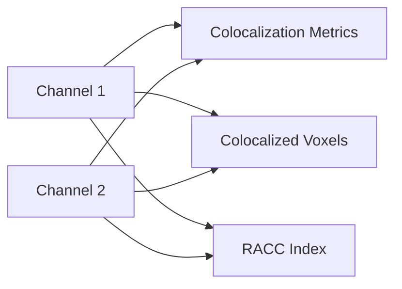
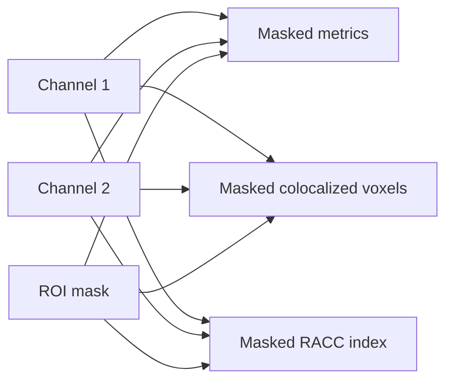

# Colocalization And Association

VIPP supports pixel, ROI-masked, object-restricted, and label-association
workflows.

## Pixel Colocalization



Use `Colocalized Voxels` for visual threshold review. Use metric tables for
quantitative reporting. These are parallel consumers of the two channels; none
is the input to the next.

## ROI-Masked Colocalization



Use masked variants when the analysis population should be restricted to cells,
regions, tissue, or user-defined ROIs.


*The same red/green channel outputs feed independent metric, voxel, and RACC
branches. The selected calculated node exposes its threshold scatter for QC.*

## What The Scatter Inspector Calculates

The colocalization inspector calculates all three summaries over every voxel in
the analysis population:

- the total ROI population (or the complete image when no ROI is connected);
- the number meeting both channel thresholds;
- the complete two-dimensional scatter-density grid.

Large datasets are processed in bounded chunks and off the user-interface
thread. Chunking limits temporary memory; it is not sampling. The density image,
ROI count, and colocalized count all represent the complete ROI population.

For example, a summary such as `Exact colocalized count: 18,420/251,006` means
that all 251,006 ROI voxels contributed to both the count and the displayed
density. The scatter grid is a visual QC summary; the metric table and
`Colocalized Voxels` output remain the appropriate quantitative artifacts.

Dragging a threshold guide switches the node to manual thresholds. This is a
scientific parameter change, not merely a plot adjustment, so recalculate stale
manual outputs and save the workflow afterward.

## Object Colocalization

```text
labels + channel 1 + channel 2
  -> Object Colocalization Metrics
```

This produces one row per object and is designed to merge with object
morphology and intensity tables.

## Label Association

Overlap between two object sets:

```text
reference labels + target labels
  -> Label Overlap Association
```

Nearest centroid association:

```text
reference labels + target labels
  -> Nearest Object Distance
```

Event or puncta assignment:

```text
events / puncta + regions / ROIs
  -> Event Localization
```

## Reference Workflows

| Workflow | Purpose |
| --- | --- |
| `synthetic-colocalization-racc.json` | Pixel and ROI-masked metrics, scatter threshold review, colocalized voxels, and RACC-like index output. |
| `synthetic-object-colocalization-association.json` | Object colocalization rows, label overlap, nearest-object distance, event localization, and merged tables. |

## Reporting Checklist

Report:

- channels analyzed;
- preprocessing steps;
- threshold mode and final thresholds;
- analysis population: whole image, ROI, or object labels;
- how the ROI was defined and its voxel count;
- whether intensities were normalized or clipped;
- 2D/3D and leading-axis handling;
- ROI or label-generation method;
- RACC parameters if using RACC-like outputs.

## Validation Note

The current implementation has method documentation and automated tests. Broad
cross-tool or biological validity claims still require deterministic benchmark
packs, external numerical comparisons, and assay-specific validation.
