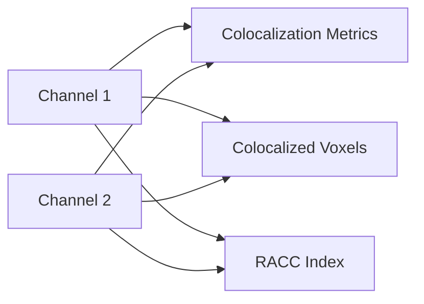
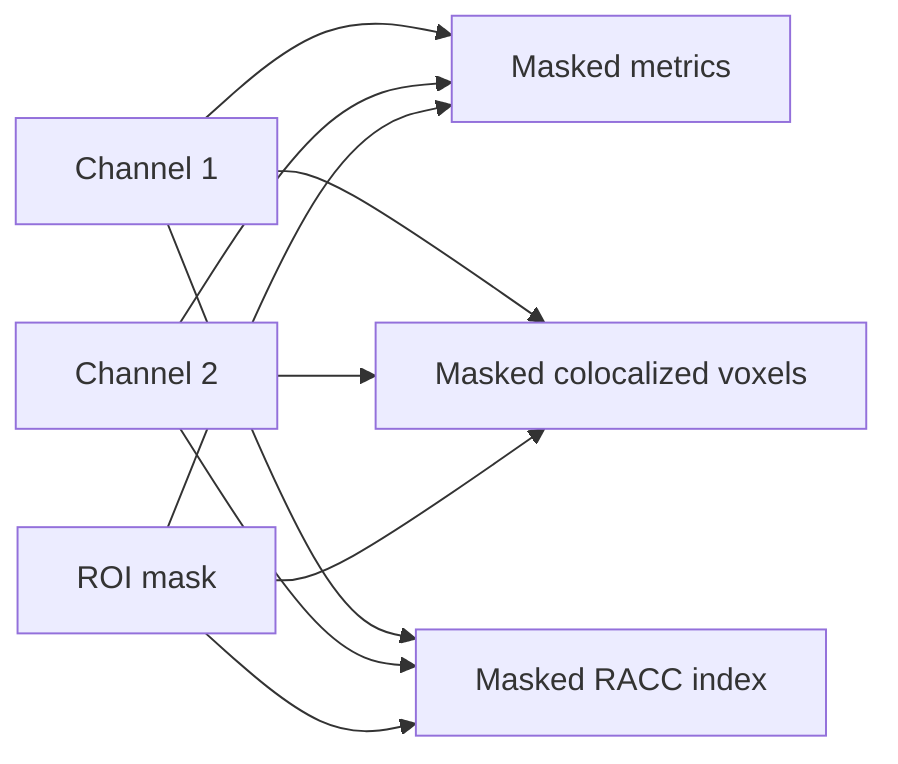

# Colocalization And Association

VIPP supports pixel, ROI-masked, object-restricted, and label-association
workflows.

!!! warning "0.13 and later colocalization results can differ from 0.12"

    VIPP 0.13 and later retain finite native channel intensities rather than jointly
    scaling/clipping both channels to 0–255. Thresholds and intensity sums now
    use native units, and the Costes, Pearson, and Manders definitions were
    revised toward Fiji Coloc 2 3.1.0 semantics. Preserve older results and
    compare externally before combining versions.

## Pixel Colocalization


```mermaid
flowchart LR
  C1["Channel 1"] --> M["Colocalization Metrics"]
  C2["Channel 2"] --> M
  C1 --> V["Colocalized Voxels"]
  C2 --> V
  C1 --> R["RACC Index"]
  C2 --> R
```

Use `Colocalized Voxels` for visual threshold review. Use metric tables for
quantitative reporting. These are parallel consumers of the two channels; none
is the input to the next.

`Colocalization Scatter Plot` produces a durable density-and-guides image in
the graph. Use it in parallel too; it is a presentation/QC output, not a
preprocessing input to the metric calculation.

## ROI-Masked Colocalization


```mermaid
flowchart LR
  C1["Channel 1"] --> M["Masked metrics"]
  C2["Channel 2"] --> M
  ROI["ROI mask"] --> M
  C1 --> V["Masked colocalized voxels"]
  C2 --> V
  ROI --> V
  C1 --> R["Masked RACC index"]
  C2 --> R
  ROI --> R
```

Use masked variants when the analysis population should be restricted to cells,
regions, tissue, or user-defined ROIs.


*The same red/green channel outputs feed independent metric, voxel, and RACC
branches. The selected calculated node exposes its threshold scatter for QC.*

## What The Scatter Inspector Calculates

The colocalization inspector calculates all three summaries over every voxel in
the analysis population:

- the total ROI population (or the complete image when no ROI is connected);
- the number meeting both channel thresholds;
- the complete two-dimensional scatter-density grid.

Large datasets are processed in bounded chunks and off the user-interface
thread. Chunking limits temporary memory; it is not sampling. The density image,
ROI count, and colocalized count all represent the complete ROI population.
The detached scatter window supports up to 4,096 bins per axis with a host-memory
preflight. The compact inspector uses a mass-preserving derivative of at most
1,024 bins per axis, not a sample of source voxels. Existing graph scatter nodes
also support independently configured histogram bins and square output size.

For example, a summary such as `Exact colocalized count: 18,420/251,006` means
that all 251,006 ROI voxels contributed to both the count and the displayed
density. The scatter grid is a visual QC summary; the metric table and
`Colocalized Voxels` output remain the appropriate quantitative artifacts.

Dragging a threshold guide previews its position and an immediate
density-derived count without invalidating the workflow on every movement.
Releasing it commits the threshold, switches the node to manual thresholds,
and recounts the complete ROI. This is a scientific parameter change, not merely
a plot adjustment: wait for the exact count, recalculate stale manual outputs,
and save the workflow afterward.

Use **Open in window** in the scatter section of `Colocalization Metrics` or
its masked variant for a larger interactive view. Colormap and log-density
changes redraw cached density; bin changes calculate a new density in the
background. **Export size** controls square PNG or TIFF output independently
of the window's size.

Both axes use a zero-inclusive shared range by default. **Zoom to populated
data** uses the selected percentile range; **Equal axis scales** makes equal
intensity differences occupy equal distances. The range readout identifies
what is visible. These display choices never clip the population used for
exact counts or metrics.

The old `Colocalization Scatter Plot` and masked graph nodes are hidden from the
palette, but remain executable in saved workflows and headless programs that
require their durable raster output. New interactive work should use the
metrics-node pop-out.

## Native intensity and metric names in 0.13 and later

- Pearson no-threshold and threshold-domain outputs now expose canonical names
  that distinguish an **any-channel-below-threshold** (OR) population from the
  **both-channels** intersection. Shorter older column names remain aliases for
  compatible table consumers; use the canonical names in new reports.
- Fiji Manders M1/M2 and thresholded tM1/tM2 are reported separately. Existing
  `manders_m1` and `manders_m2` columns now alias thresholded tM1/tM2. The older
  above-threshold intersection fractions remain under descriptive non-Manders
  names.
- Automatic Costes thresholds target Fiji Coloc 2 3.1.0's classic search,
  including native one-unit steps and its population/tie behavior. This is a
  source-aligned compatibility implementation, not completed independent
  parity certification.

Pixel and object tables record `coloc_semantics=fiji_coloc2_3.1` and
`coloc_validation_status=experimental_source_aligned_golden_parity_pending`.
Archive both fields and the exact column names used in analysis. Independent
Fiji-generated golden parity remains pending, so validate this path externally
before consequential use.

## Object Colocalization

```text
labels + channel 1 + channel 2
  -> Object Colocalization Metrics
```

This produces one row per object and is designed to merge with object
morphology and intensity tables.

## Label Association

Overlap between two object sets:

```text
reference labels + target labels
  -> Label Overlap Association
```

Nearest centroid association:

```text
reference labels + target labels
  -> Nearest Object Distance
```

Event or puncta assignment:

```text
events / puncta + regions / ROIs
  -> Event Localization
```

## Reference Workflows

| Workflow | Purpose |
| --- | --- |
| `synthetic-colocalization-racc.json` | Pixel and ROI-masked metrics, scatter threshold review, colocalized voxels, and RACC-like index output. |
| `synthetic-object-colocalization-association.json` | Object colocalization rows, label overlap, nearest-object distance, event localization, and merged tables. |

## Reporting Checklist

For exact exported definitions, see [Pearson, Manders, and Costes](../reference/colocalization-metrics.md),
the [RACC-like index](../reference/racc-index.md), and
[object-association fields](../reference/association-metrics.md).

Report:

- channels analyzed;
- preprocessing steps;
- threshold mode and final thresholds;
- analysis population: whole image, ROI, or object labels;
- how the ROI was defined and its voxel count;
- whether intensities were normalized or clipped;
- native intensity units and the exact metric column names/semantic status;
- scatter histogram bins, output size, clipping, and axis range when a scatter
  image is retained as evidence;
- 2D/3D and leading-axis handling;
- ROI or label-generation method;
- RACC parameters if using RACC-like outputs.

## Validation Note

The current implementation has frozen method documentation and automated
regression tests, but independent Fiji-generated numerical parity remains
pending. Broad cross-tool or biological validity claims still require external
comparisons, positive/negative controls, and assay-specific validation.
