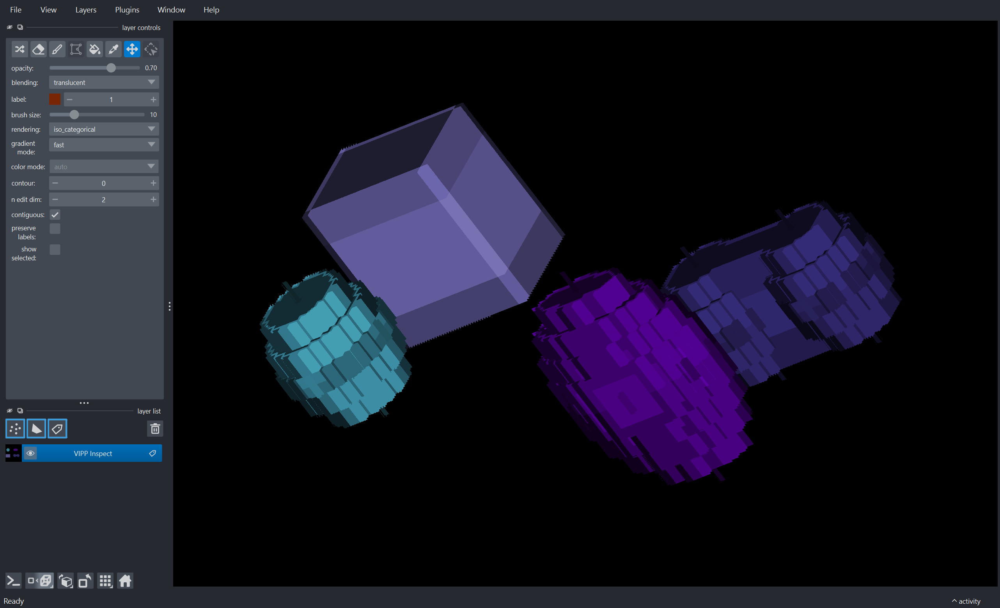
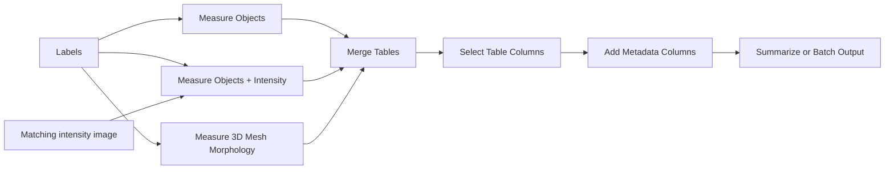
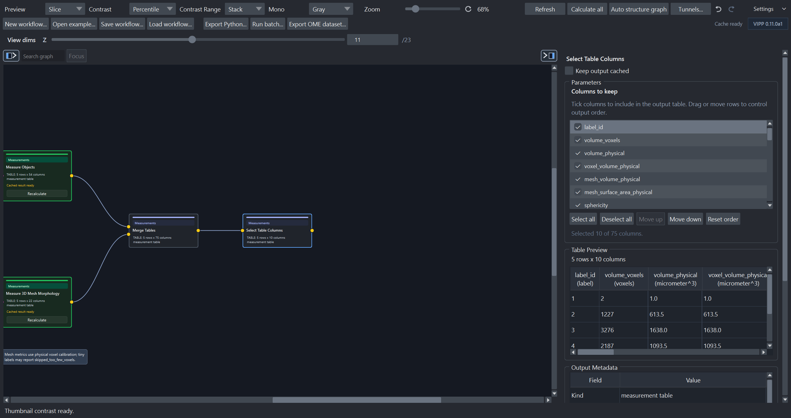

# Object Measurements And Tables

Measurement workflows start from labels and produce tables.

## Basic Object Measurement

```text
labels
  -> Measure Objects
```

`Measure Objects` reports object identity, size, centroid, bounding box,
equivalent diameter, extent, Euler number, and optional morphology groups. When
spatial scale metadata exists, physical-unit columns are emitted where the
calculation is well-defined.

## Object Plus Intensity

```text
labels + matching intensity image
  -> Measure Objects + Intensity
```

This produces object morphology plus per-label intensity summaries such as
mean, minimum, maximum, sum, and standard deviation.

Use this when you want measurements such as:

- intensity per nucleus;
- reporter intensity per cell;
- channel intensity inside segmented objects;
- object features for PCA or treatment separation.

## 3D Mesh Morphology

```text
3D labels
  -> Measure 3D Mesh Morphology
```

Use this for true `ZYX` labels when surface area, mesh volume, sphericity,
convex hull metrics, or 3D solidity matter.

This node is manual/cached because mesh calculations can be expensive.



*Inspect the 3D label geometry as well as the resulting table. The bundled
phantom includes varied shapes and anisotropic calibration for regression and
demonstration—not biological validation.*

## Table Assembly



Only merge branches that share compatible identity keys and meaning. A table
with the expected row count can still be wrong if time, label, or source
identity columns were dropped or misaligned.



*The bundled mesh example combines calibrated object and mesh measurements,
then selects a compact table whose rows, columns, units, and values can be
reviewed before export.*

## Reference Workflows

| Workflow | Purpose |
| --- | --- |
| `red-channel-object-intensity-measurements.json` | Labels plus matching intensity image into `Measure Objects + Intensity`. |
| `red-channel-merged-measurement-table.json` | Object morphology, intensity, table merge, and metadata columns. |
| `synthetic-measurement-summary.json` | Grouped summaries with known object counts and areas. |
| `synthetic-derived-object-morphology.json` | Derived 2D morphology, circularity, and Hu moments. |
| `synthetic-3d-mesh-morphology.json` | True-3D mesh morphology on anisotropic synthetic objects. |

## What To Check Before Export

- Are labels correct?
- Are label IDs stable after filtering?
- Are scale and units correct?
- Are leading axes such as time represented by identity columns?
- Do table units match the reported measurement?
- Have metadata columns such as treatment, replicate, or batch been added?
