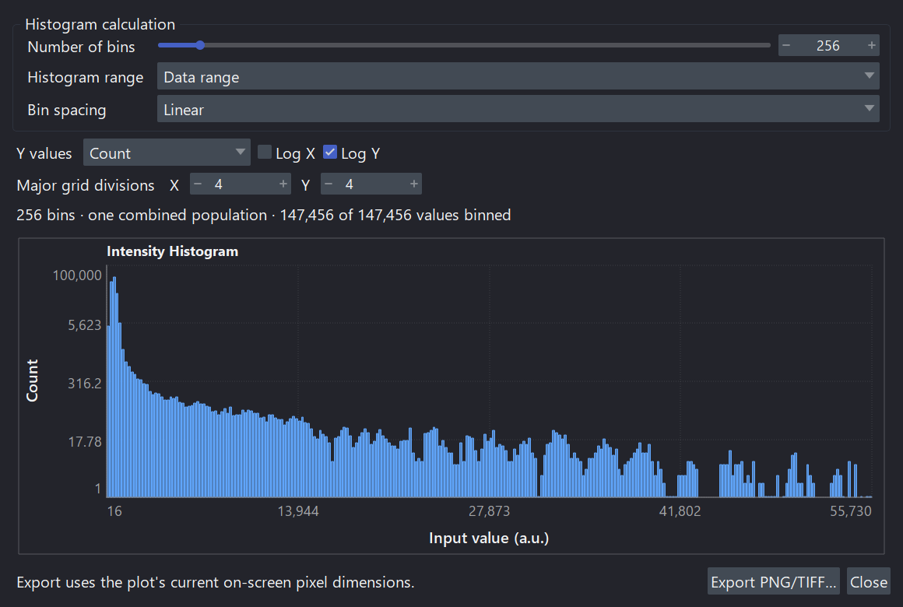
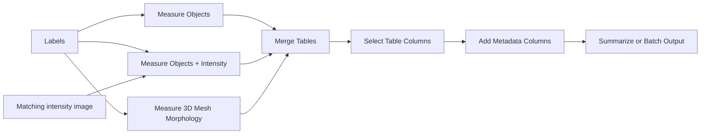

# Object Measurements And Tables

Measurement workflows start from labels or, in nightly, mesh objects and
produce tables.

## Inspect and export the complete table

Select a calculated measurement node and expand **Results**. The compact table
provides a quick preview; **Open in window** opens every row in a resizable
result-table window. Click column headings to sort and inspect outliers, units,
missing values, and per-object status/error fields.

Sorting is display-only. **Export CSV/TSV…** writes the exact scientific table
in workflow row order, not the sorted presentation order. If upstream data or
parameters changed, recalculate the stale manual result before exporting it.
The result window shows the stale/current state rather than silently treating
an old table as a new calculation.

## Reproducible intensity histograms

`Intensity Histogram` produces a full-data table from one connected numeric
array. Choose bin count, data-derived or custom bounds, and linear or logarithmic
bin spacing. These are scientific settings saved with the workflow, unlike a
display-only inspector histogram. The node is manual/cached by default.

Its table contains bin edges, centres, widths, counts, fractions, densities,
and cumulative values. Non-finite values are excluded; custom-range underflow
and overflow and values excluded from logarithmic bins are recorded in metadata.
Review those counts instead of assuming every pixel fell inside the plot.

The inspector and histogram pop-out use the calculated table without rereading
the source to redraw it. Switching between count, fraction, density, or cumulative
views changes presentation, not the bin calculation. Use Results to inspect or
export the exact values. A comparison between different images still needs an
explicit shared range, common bin edges, and a justified normalization.



*The histogram is a view of the cached scientific table. Retain its bin edges
and excluded-value metadata when reporting the distribution.*

## Basic Object Measurement

```text
labels
  -> Measure Objects
```

`Measure Objects` reports object identity, size, centroid, bounding box,
equivalent diameter, extent, Euler number, and optional morphology groups. When
spatial scale metadata exists, physical-unit columns are emitted where the
calculation is well-defined.

## Object Plus Intensity

```text
labels + matching intensity image
  -> Measure Objects + Intensity
```

This produces object morphology plus per-label intensity summaries such as
mean, minimum, maximum, sum, and standard deviation.

Use this when you want measurements such as:

- intensity per nucleus;
- reporter intensity per cell;
- channel intensity inside segmented objects;
- object features for PCA or treatment separation.

## CPU and GPU measurement coverage

In 0.15.0a1, the CuPy candidates for label-table measurements cover only the basic `Measure Objects` and
`Measure Objects + Intensity` schemas. They require native-endian,
non-negative `int32` labels in resolved 2D/3D leading blocks. The intensity
variant additionally accepts matching Boolean, `uint8`, `uint16`, or finite
`float32` intensity data.

Enabling shape/axis/boundary descriptors, derived ratios, 2D moments, or other
extended groups keeps the complete node on the authoritative CPU path. This is
expected and appears in the node decision; the GPU provider never returns a
reduced table while pretending the requested schema was complete. Its bounded
device calculation is finished by an exact typed host-table finalizer that
preserves schema, row/column order, units, integer fields, and missing-value
semantics. A one-pixel object's population standard deviation is exactly zero.

The standard `gpu-cuda13` extra includes these CuPy providers. No separate
provider build or installation is required. See the
[Windows NVIDIA GPU guide](../getting-started/windows-cuda.md) and
[choose and verify compute](../how-to/choose-compute.md).

VIPP 0.15.0a1 additionally provides a hybrid GPU path for **Measure 3D Mesh
Morphology** on supported non-negative native `int32` 3D labels. The GPU packs
label regions; marching cubes, convex hulls, and exact public table construction
remain authoritative CPU work. A GPU badge therefore does not mean every part
of a mesh calculation ran on the device or that it must be faster.

**Analyze Skeleton** has a reviewed CuPyX path for Boolean, already-skeletonized
2D/3D inputs. Requesting skeletonization first remains CPU work. Both providers
retain dtype, shape, environment, memory, and scientific admission gates. See
the [compute matrix](../how-to/choose-compute.md#gpu-regions-in-0150a1) for scope.

## 3D Mesh Morphology

```text
3D labels
  -> Measure 3D Mesh Morphology
```

Use this for true `ZYX` labels when surface area, mesh volume, sphericity,
convex hull metrics, or 3D solidity matter.

This node is manual/cached because mesh calculations can be expensive.

!!! info "Unreleased — additional inputs in nightly"
    You can also connect a **Boolean mask** or an existing **Mesh**.

    - **Mask:** all foreground is one object. Use **Label Connected Components**
      first when you need a separate row per object.
    - **Mesh:** measures the supplied triangles directly, with one row per
      explicit mesh object and its stable `mesh_id`. Disconnected parts with
      the same ID stay in that row. Spatial mode and Minimum voxel count do not
      apply. Calibration is retained and compatible units convert to the
      X-axis unit; voxel counts and voxel volume are not inferred.

    Open, degenerate, non-manifold or inconsistently wound surfaces have `NaN`
    volume-derived fields and an explanation in `mesh_status`/`mesh_error`.
    Area and extents remain available. These checks do not detect every possible
    self-intersection or certify a mesh for printing.

Use [3D Meshes](mask-to-mesh.md) to create surfaces, retain label IDs, assign
colours, combine, split, filter or refine objects, and export 3MF/OBJ. Mesh
measurements use the current triangles, including any smoothing or
simplification, without extracting a new surface. The cached-mesh path stays
on CPU with **Auto** or **Prefer GPU** as well.

Keep `mesh_id` when exporting tables. Filtering and refinement retain IDs;
combining can remap duplicate IDs, and splitting creates additional IDs.
Recalculate measurements after those operations instead of joining an older
table by row position. Original/parent identities remain in mesh metadata.


*Inspect the 3D label geometry as well as the resulting table. The bundled
phantom includes varied shapes and anisotropic calibration for regression and
demonstration—not biological validation.*

## Table Assembly

Manual/cached sibling measurements can be calculated in either order. Since
0.14.0a1, re-reading or re-materializing the same unchanged file revision does
not stale a ready sibling merely because Python created a different array
wrapper. For example:

```text
labels -> Measure Objects -----------------> Merge Tables
      \-> Measure 3D Mesh Morphology ------/
```

Calculate both manual nodes. Each should remain **ready**, and Merge Tables
should become calculable once it has both coherent tables. This also applies
when low-memory cache pruning re-materializes the same pinned source revision.

A genuine edit still invalidates the appropriate descendants. Recheck both
branches after changing the source file/revision, labels, intensity input,
parameters, or connections. If siblings alternate between ready and stale
without any such change, preserve the workflow and execution details and
[report the problem](../troubleshooting/report-a-problem.md); repeatedly
recalculating is not a valid workaround for an incoherent merge.


```mermaid
flowchart LR
  L["Labels"] --> M["Measure Objects"]
  L --> I["Measure Objects + Intensity"]
  X["Matching intensity image"] --> I
  L --> D["Measure 3D Mesh Morphology"]
  M --> J["Merge Tables"]
  I --> J
  D --> J
  J --> S["Select Table Columns"]
  S --> A["Add Metadata Columns"]
  A --> U["Summarize or Batch Output"]
```

Only merge branches that share compatible identity keys and meaning. A table
with the expected row count can still be wrong if time, label, or source
identity columns were dropped or misaligned.


*The bundled mesh example combines calibrated object and mesh measurements,
then selects a compact table whose rows, columns, units, and values can be
reviewed before export.*

## Reference Workflows

| Workflow | Purpose |
| --- | --- |
| `red-channel-object-intensity-measurements.json` | Labels plus matching intensity image into `Measure Objects + Intensity`. |
| `red-channel-merged-measurement-table.json` | Object morphology, intensity, table merge, and metadata columns. |
| `synthetic-measurement-summary.json` | Grouped summaries with known object counts and areas. |
| `synthetic-derived-object-morphology.json` | Derived 2D morphology, circularity, and Hu moments. |
| `synthetic-3d-mesh-morphology.json` | True-3D mesh morphology on anisotropic synthetic objects. |

## What To Check Before Export

Use [measurement tables and units](../reference/measurement-tables.md) for
identity keys, unit propagation, physical-column limits, and mesh-status fields.

- Are labels correct?
- Are label IDs stable after filtering?
- Are scale and units correct?
- Are leading axes such as time represented by identity columns?
- Do table units match the reported measurement?
- Have metadata columns such as treatment, replicate, or batch been added?
