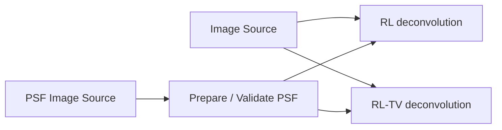
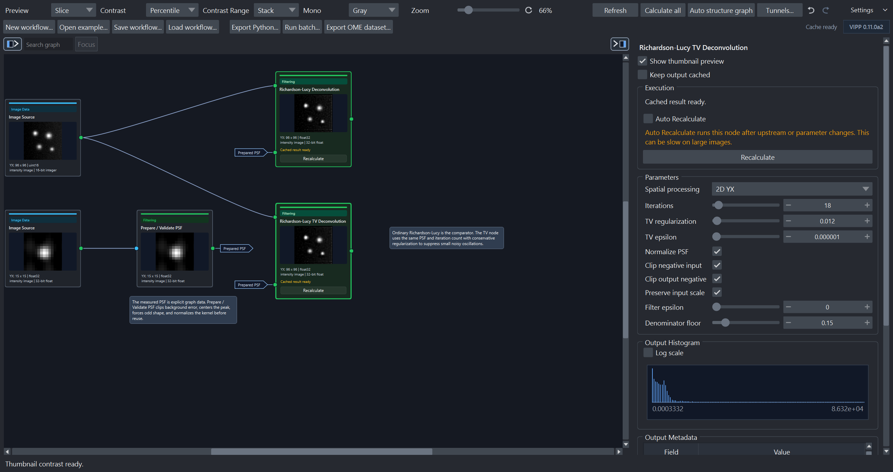
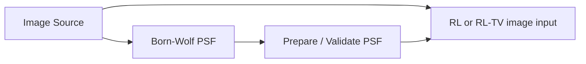

# Restore with a PSF

Born-Wolf PSF generation, measured-PSF preparation, Richardson–Lucy (RL), and
RL with total-variation regularization (RL-TV) are public in 0.11.0a2. The
deconvolution nodes are manual/cached so parameter changes do not repeatedly
start expensive work without an explicit calculation.

!!! caution "Evidence boundary"
    Synthetic examples and automated checks support operation behavior. They do
    not establish broad restoration quality on real microscopes, acquisition
    settings, or biological targets. Review noise, ringing, edges, and apparent
    structures against an appropriate reference.

## Use a measured PSF

The image and PSF are independent inputs; the two restoration methods branch
in parallel for comparison:

1. Load the image and measured PSF in separate `Image Source` nodes.
2. Send the PSF through `Prepare / Validate PSF`.
3. Connect the same image and prepared PSF to each restoration branch.
4. Calculate one branch at a time while establishing safe parameters.
5. Compare each output with the unchanged input; do not feed RL into RL-TV when
   the intent is method comparison.

*Both calculated alternatives use the same image and prepared PSF. The RL-TV
inspector shows the iteration and regularization choices used for that branch.*

## Generate a Born-Wolf PSF

`Born-Wolf PSF` uses a reference image to resolve compatible axes/channels and
can draw on supported pixel size, z-step, channel, and objective metadata.
Explicit parameter overrides remain the user's responsibility.

Multi-channel reference data can produce dynamic PSF output ports. Inspect the
resolved channel and dimensionality before connecting a restoration node.

## Prepare and inspect the PSF

Depending on its settings, `Prepare / Validate PSF` can clip negative values,
center the peak or centroid, normalize the sum, force odd shape, and reject an
invalid kernel. Keep it visible in the graph so the actual kernel can be
inspected independently from the restored image.

Check:

- dimensionality and sampling compatibility between image and PSF;
- centering and normalization;
- correct x/y pixel size and z-step;
- noise amplification, ringing, boundary artifacts, and invented-looking fine
  structure;
- sensitivity to iteration count and TV regularization;
- whether conclusions remain when compared with the original image.

## Bundled examples

| Example | Purpose |
| --- | --- |
| `deconvolution-2d` | 2D measured PSF with RL and RL-TV parallel branches. |
| `deconvolution-3d` | `ZYX` measured PSF and volumetric restoration branches. |

Real bead-PSF and representative microscopy validation remains a high-priority
evidence gap; see [validation status](../reference/validation-status.md).
