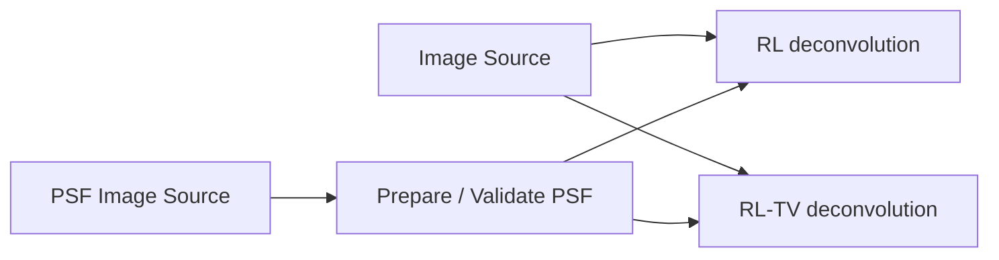
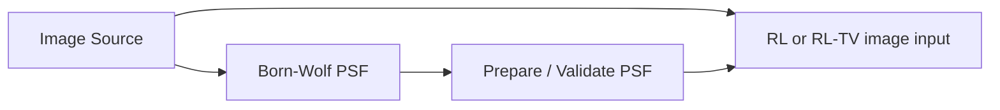

# Restore with a PSF

Born-Wolf PSF generation, measured-PSF preparation, Richardson–Lucy (RL), and
RL with total-variation regularization (RL-TV) are public in 0.12.0a1. The
deconvolution nodes are manual/cached so parameter changes do not repeatedly
start expensive work without an explicit calculation. While a deconvolution is
stale, its descendants retain their last coherent cached results and wait.
Recalculating the deconvolution resumes that downstream branch.

!!! caution "Evidence boundary"
    Synthetic examples and automated checks support operation behavior. They do
    not establish broad restoration quality on real microscopes, acquisition
    settings, or biological targets. Review noise, ringing, edges, and apparent
    structures against an appropriate reference.

## Use a measured PSF

The image and PSF are independent inputs; the two restoration methods branch
in parallel for comparison:



1. Load the image and measured PSF in separate `Image Source` nodes.
2. Send the PSF through `Prepare / Validate PSF`.
3. Connect the same image and prepared PSF to each restoration branch.
4. Calculate one branch at a time while establishing safe parameters.
5. Compare each output with the unchanged input; do not feed RL into RL-TV when
   the intent is method comparison.


*Both calculated alternatives use the same image and prepared PSF. The RL-TV
inspector shows the iteration and regularization choices used for that branch.*

## Generate a Born-Wolf PSF

`Born-Wolf PSF` uses a reference image to resolve compatible axes/channels and
can draw on supported pixel size, z-step, channel, and objective metadata.
Explicit parameter overrides remain the user's responsibility.



Multi-channel reference data can produce dynamic PSF output ports. Inspect the
resolved channel and dimensionality before connecting a restoration node.

### Choose Born-Wolf support

The sampling interval, PSF support, and image extent are different quantities.
Keeping them separate prevents several common configuration mistakes:

| Quantity | Meaning | How VIPP obtains it |
| --- | --- | --- |
| XY pixel size and Z step | Physical distance between neighboring PSF samples | Read from supported image metadata or entered manually |
| XY and Z support | Finite number of samples retained around the PSF center | Chosen by the user; the defaults are starting values |
| Image extent | Number of acquired pixels or planes available for restoration | Determined by the input image |
| Pupil samples | Numerical quadrature resolution for PSF generation | Chosen by the user; independent of spatial sampling and support |

`Auto from metadata` can resolve physical sampling and supported optical
parameters. It cannot determine one universally correct finite support. The
ideal optical model has tails, so choosing an array boundary also chooses a
truncation tolerance. VIPP keeps that choice explicit and checks the generated
kernel rather than presenting a metadata-derived cutoff as exact.

The physical span shown beside a support field is the distance between the two
outer sample centers:

```text
physical span = (support samples - 1) x sampling interval
```

This value helps compare settings across datasets, but it is not by itself a
pass/fail criterion.

#### A repeatable selection procedure

1. Resolve or enter wavelength, numerical aperture, refractive index, XY pixel
   size, and Z step. Confirm their units and channel assignment.
2. Review the widefield Nyquist result separately. A Nyquist warning describes
   acquisition sampling; increasing PSF support cannot reconstruct frequencies
   that were not sampled.
3. Begin with odd support dimensions. Calculate the Born-Wolf PSF.
4. Read the tail-containment result. VIPP measures the fraction of normalized
   intensity on the outermost one-sample shell. If it exceeds the current 1%
   practical threshold, increase the identified axis and calculate again.
5. Review image extent independently. The PSF should normally be smaller than
   the image on every processed spatial axis. If it is not, review boundary
   assumptions and whether the acquisition covers enough context.
6. Inspect the generated PSF and restored result. Check centering, normalization,
   ringing, edge behavior, noise amplification, and sensitivity to reasonable
   parameter changes.

!!! note "What the tail percentage means"
    The percentage is intensity **on the sampled boundary**, not a measurement
    of intensity outside the array. Passing the check is a practical indication
    that the boundary values are small; it is not proof that all omitted tail
    energy is below exactly 1%.

Two warnings can therefore coexist without contradiction:

- **Nyquist met, tail warning:** the PSF is sampled finely enough, but the
  finite kernel window should be enlarged on the named axis.
- **Tail check passed, image-extent warning:** the kernel window contains its
  modeled tail adequately, but the image is too short on an axis for every
  output location to have complete support under the current boundary model.

Do not shrink a PSF only to remove an image-extent warning. For volumetric
restoration, possible responses include acquiring guard planes around the
region of interest, interpreting or cropping affected output margins, or using
2D YX processing only when independent plane-wise imaging is the intended
scientific model.

#### Why XY support is square

VIPP's scalar Born-Wolf generator uses one XY sampling interval and a
rotationally symmetric optical model. It therefore produces a square YX kernel
even when the camera frame is rectangular. The kernel describes the response
around a point, not the camera field of view. A measured PSF or a more specific
optical model is more appropriate when the system is astigmatic, spatially
varying, or otherwise not rotationally symmetric.

#### Why some Fiji or ImageJ examples use image-sized PSFs

Software packages can impose different array-shape conventions while modeling
the same physical sampling. The [ImageJ deconvolution guide](https://imagej.net/imaging/deconvolution/)
describes PSF width, height, and depth as PSF dimensions and permits a PSF equal
to or smaller than the image. A [PyImageJ 3D deconvolution example](https://py.imagej.net/en/latest/Deconvolution.html)
constructs an image-sized diffraction kernel for that particular operation.

VIPP accepts a smaller centered kernel, so its support dimensions do not need
to equal the image dimensions. What must remain compatible is the physical
sampling interval and spatial dimensionality. Matching the full image shape in
VIPP can add substantial generation, memory, and convolution cost without
improving the optical model.

#### Other user-set Born-Wolf parameters

| Parameter | Practical interpretation |
| --- | --- |
| `Pupil samples` | Numerical integration accuracy. Use the default for ordinary work; for stringent validation, compare increasing values and stop when the generated PSF and downstream result have converged sufficiently for the analysis. |
| `Normalize sum to 1` | Normally keep enabled for Richardson-Lucy restoration so the PSF acts as a unit-sum blur kernel. |
| `Channel` | Confirm that the selected or automatically resolved wavelength belongs to the image channel being restored. |
| `Spatial processing` | Use 3D ZYX for a genuinely volumetric image and PSF model; use 2D YX only when planes are intended to be processed independently. |

The Born-Wolf model and its Nyquist summary describe conventional widefield
fluorescence. Reconstructed SIM, confocal, light-sheet, aberrated, or other
modalities may require a measured or modality-specific PSF and sampling model.

## Prepare and inspect the PSF

Depending on its settings, `Prepare / Validate PSF` can clip negative values,
center the peak or centroid, normalize the sum, force odd shape, and reject an
invalid kernel. Keep it visible in the graph so the actual kernel can be
inspected independently from the restored image.

Check:

- dimensionality and sampling compatibility between image and PSF;
- centering and normalization;
- correct x/y pixel size and z-step;
- noise amplification, ringing, boundary artifacts, and invented-looking fine
  structure;
- sensitivity to iteration count and TV regularization;
- whether conclusions remain when compared with the original image.

## Understand the RL-TV controls

Hover a Richardson-Lucy TV parameter label, slider, spinner, checkbox, or
choice control for a concise effect-oriented tooltip. Slider ranges are
practical exploration windows; the adjacent spinner is the exact-entry control
and accepts valid values outside the slider window.

| Parameter | Slider window | Interpretation |
| --- | --- | --- |
| `Spatial processing` | Choice | Use 3D ZYX only for a true volumetric image/PSF pair; use 2D YX for independent planes. |
| `Iterations` | Linear 1–100 | Start around 10–30. More iterations can recover detail but increase time and amplify noise, ringing, or PSF mismatch. |
| `TV regularization` | Geometric 1e-6–0.1 | Larger values suppress noise more strongly but can flatten fine structure. Enter `0` in the spinner for ordinary RL behavior. |
| `TV epsilon` | Geometric 1e-12–1e-2 | Smooths the TV gradient norm near zero; change it only with a defined stability test. |
| `Filter epsilon` | Geometric 1e-15–1e-3 | Suppresses unstable ratio updates where predicted blur is tiny. Enter `0` in the spinner to disable it. |
| `Denominator floor` | Geometric 1e-3–1 | Larger values limit extreme TV correction but can weaken the regularization update. |

`Normalize PSF` is normally enabled. `Clip negative input` and `Clip output
negative` are usually appropriate for non-negative microscopy intensity data,
but clipping is a scientific choice. `Preserve input scale` maps the result
back near the input intensity scale after internal normalization.

The positive logarithmic sliders use true geometric interpolation, making
orders of magnitude accessible without sacrificing spinner precision. Do not
treat the ends of a slider as validated parameter limits.

## Bundled examples

| Example | Purpose |
| --- | --- |
| `deconvolution-2d` | 2D measured PSF with RL and RL-TV parallel branches. |
| `deconvolution-3d` | `ZYX` measured PSF and volumetric restoration branches. |

Real bead-PSF and representative microscopy validation remains a high-priority
evidence gap; see [validation status](../reference/validation-status.md).
