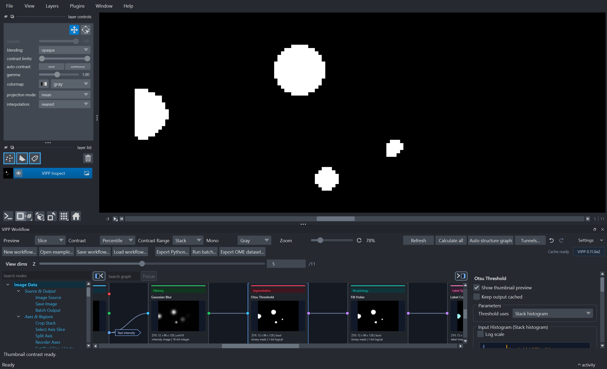

# Segmentation And Label Cleanup

Segmentation workflows usually turn an intensity image into a mask, then into
labels.

## Basic Pattern

```text
Image Source
  -> Extract Channel or Split Channels
  -> optional background correction / denoising
  -> threshold
  -> morphology cleanup
  -> Label Connected Components
  -> label filtering
```

## Recommended First Graph

```text
Image Source
  -> Split Channels
  -> Gaussian Blur
  -> Otsu Threshold
  -> Fill Holes
  -> Remove Small Objects
  -> Label Connected Components
  -> Filter Labels By Volume
```

## Key Nodes

| Step | Common nodes |
| --- | --- |
| Channel selection | `Extract Channel`, `Split Channels` |
| Smoothing | `Gaussian Blur`, `Gaussian Blur 3D`, `Median Filter`, `Non-Local Means` |
| Background | `Rolling-Ball Background`, `Subtract Background` |
| Threshold | `Otsu Threshold`, `Triangle Threshold`, `Li Threshold`, `Yen Threshold`, `Binary Threshold`, local threshold nodes |
| Mask cleanup | `Fill Holes`, `Remove Small Objects`, morphology nodes |
| Label creation | `Label Connected Components`, watershed nodes |
| Label cleanup | `Clear Border Objects`, `Filter Labels By Volume`, `Filter Labels By Property`, `Relabel Sequential` |

## How Global Automatic Thresholds Use The Data

`Otsu Threshold`, `Triangle Threshold`, `Yen Threshold`, `Isodata Threshold`,
and `Minimum Threshold` calculate from every finite value in the selected
scope. VIPP does not estimate these thresholds from a pixel sample.

| Input | Scientific behavior |
| --- | --- |
| Boolean mask | The input is already a segmentation, so VIPP preserves its `True`/`False` decisions instead of thresholding it again. |
| Integer image | Every native integer level from the observed minimum to maximum receives its own bin. This is exact for spans of up to 65,536 levels. |
| Floating-point image | All finite values are counted into the saved **Float histogram bins** setting: 2–65,536 bins, with 256 as the default. |
| Li threshold | Li operates iteratively on the raw finite intensity values and does not have a histogram-bin setting. Integer inputs retain exact native offsets; a relative span wider than 2^53 reports an error because Li's float64 iteration cannot represent every level faithfully. |

For a wide integer image whose observed range spans more than 65,536 levels,
VIPP stops with an explanatory error. It does not silently merge integer
levels. Convert or rescale deliberately to `uint16` or floating point, record
that step, and inspect its effect before thresholding.

`NaN`, positive infinity, and negative infinity are excluded while an
automatic threshold is calculated. Those pixels become `False` (background)
in the output mask. An empty input or one containing no finite values reports
an error instead of receiving an invented cutoff.

!!! important "The float bin count is a method parameter"

    For floating-point data, changing **Float histogram bins** can change the
    threshold and the resulting mask. The value is saved in the workflow. The
    bins drawn in the inspector are a separate display choice and do not
    replace this setting.

### Practical bin guidance

- For `uint8`, `uint16`, or another integer image with a range of at most
  65,536 levels, leave **Float histogram bins** alone: integer levels are
  counted natively regardless of that float-only setting.
- For floating-point images, start with the saved default of 256. On the
  development set, compare scientifically plausible alternatives such as 256,
  1,024, and 4,096 when the decision appears bin-sensitive.
- Do not assume that the largest allowed value is automatically best. More
  bins can make a sparse or noisy histogram less stable.
- Freeze and report the selected value with the threshold scope and
  preprocessing steps.

For example, a methods record might state: “Otsu thresholding used the complete
`float32` stack with 1,024 histogram bins; non-finite pixels were treated as
background.”

## Minimum Threshold Failure Is Explicit

`Minimum Threshold` repeatedly smooths the exact histogram until two maxima
remain, then selects the valley between them. **Maximum smoothing iterations**
is a saved parameter from 1 to 10,000; the default is 10,000.

Some distributions do not have a suitable two-peak solution. If two maxima
cannot be found, or the saved iteration limit is reached, the node reports a
failure. VIPP does not silently substitute Otsu, reuse an old threshold, or
return a plausible-looking mask. Treat the failure as evidence that this
method is unsuitable for that input or that preprocessing needs review.

## 2D Versus 3D

For z-stacks, decide whether objects should be connected across `Z`.

- Use 2D processing when each `YX` plane should be independent.
- Use 3D processing when the object exists as one `ZYX` volume.
- Use `Auto from axes` only after checking that VIPP has interpreted the axes
  correctly.

## Split Touching Objects

Use watershed when simple connected components merge neighboring objects:

```text
mask
  -> Euclidean Distance Transform
  -> H-Maxima Markers
  -> Marker-Controlled Watershed
  -> Filter Labels By Volume
```

For a compact single-node starting point, use `Auto Watershed From Mask`.

## Reference Workflow

Use:

```text
examples/otsu-red-channel-labels.json
```

This demonstrates red/TRITC-like channel segmentation, mask cleanup, labels,
border clearing, volume filtering, and inspectable outputs.

## What To Check



*Inspect a decisive intermediate at full resolution. Here the threshold mask is
pinned in napari while its graph node and input histogram remain visible.*

- Does the mask include the biology of interest?
- Are background/noise structures being labeled as objects?
- Are touching objects merged?
- Are small objects biological or artifacts?
- Are physical units correct before size filtering or measurement?
