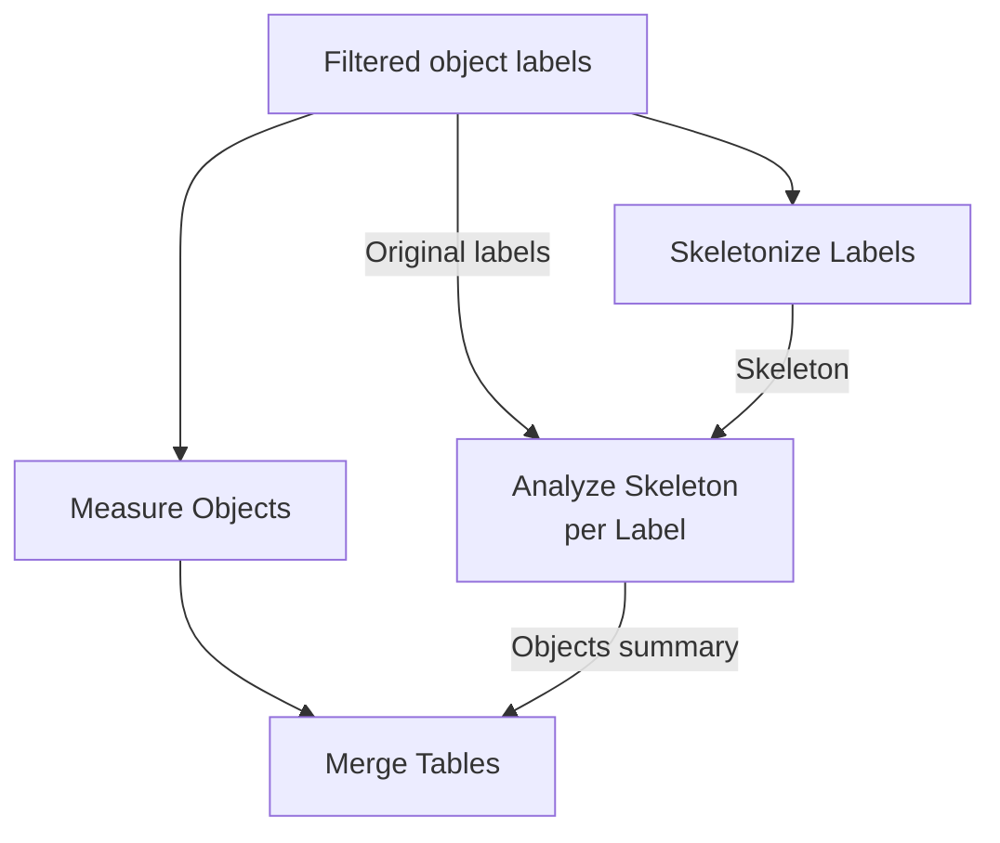

# Skeleton And Network Analysis

Skeleton workflows analyze curvilinear structures such as mitochondria,
neurites, vessels, fibers, and similar networks.

## Basic QC Workflow

```text
binary mask
  -> Skeletonize
  -> Skeleton Graph Overlay
```

Use the overlay to check endpoints, junctions, isolated voxels, and branch
structure before trusting tables.

## Choose 2D or volumetric 3D skeletonization

Select **Skeletonize** and review both **Spatial processing** and **Method**:

- **Auto from axes** resolves declared `YX` as 2D and declared `ZYX` as one 3D
  volume. An ambiguous `QYX` source is rejected until its page meaning is
  declared.
- **2D YX** processes each leading YX plane independently.
- **3D ZYX** processes each ZYX block once as a volume. For `TZYX`, each time
  point is an independent 3D block; time points are never joined.

Auto chooses Zhang for 2D and Lee for 3D. **Zhang 2D** cannot be combined with
a resolved 3D ZYX volume. The output preserves shape, effective axes,
calibration, and leading dimensions, and its history records the resolved
method and whether processing used a 2D plane or a volumetric block. The 3D
Lee route uses a 3x3x3 neighbourhood with the image boundary treated as
background.

!!! warning "Slice-wise and volumetric results answer different questions"
    Independent YX thinning can change cross-Z connectivity, endpoints,
    junctions, cycles, and branch lengths even when every individual slice
    looks plausible. Use 3D only when Z semantics and spacing are independently
    supported by the acquisition record.

For visual QC, duplicate a representative mask branch and run one Skeletonize
node as **2D YX** and the other as **3D ZYX**. Inspect XY, XZ, and YZ views in
napari, then compare overlays, component counts, endpoints, junctions, and
branch lengths. A bundled synthetic phantom is useful for regression, but it
does not validate a biological segmentation or the acquisition's Z scale.

## Measurement Workflows

### Join skeleton and morphology per object

!!! info "Unreleased after 0.16.0a1"
    **Skeletonize Labels** and **Analyze Skeleton per Label** preserve the
    object IDs needed for a reliable table join. Existing skeleton-first
    workflows remain supported.

Choose **Open example… → Skeletons & Networks → Per-label Skeleton &
Morphology** to try a three-object synthetic image with calibrated spacing.

1. Label the segmented mask and apply object filtering once.
2. Connect the filtered labels to both **Measure Objects** and **Skeletonize
   Labels**. Inspect the skeleton image: surviving skeleton voxels keep their
   original object label.
3. Connect those same filtered labels to **Analyze Skeleton per Label →
   Original labels** and the labeled skeleton to its optional **Skeleton** input.
4. Inspect the **Objects** summary table and **Skeleton components** output. The summary
   keeps one row for every original object; component details retain both
   `label_id` and a component ID within that object.
5. Connect morphology and the per-label summary to **Merge Tables**. For this
   single 3D image, join on `label_id`. Across images, timepoints, channels or
   slices, include those identity columns too.
6. Open the example's scatter plot to compare each object's volume with its
   own skeleton length. Keep the full raw tables before selecting analysis
   features.



The sample contains a branched network, a separate line and one isolated
voxel. Its synthetic spacing is 0.45 micrometer on all three axes. Raise the
minimum volume from 1 to 2 voxels and calculate again: the isolate is removed
from **both** branches. These settings demonstrate consistent object
selection; they are not segmentation settings validated for acquired images.

Retain connected-component and isolate measurements. They describe different
features: `skeleton_component_count` counts pieces within an object;
`isolated_node_count` counts skeleton voxels with no neighbors. The latter
does not count every separate mitochondrial object. For the cell's complete
network, keep a separate **Measure Overall Skeleton Network** branch as
needed. Adjacent skeletons from different labels can connect when treated
as one binary mask, so its topology need not equal a sum of per-label metrics.

See the [per-label reference](../reference/skeleton-nodes.md#analyze-skeleton-per-label)
for empty skeletons, calibration, graph connectivity and table identity.

### Keep skeleton-first analysis when that is the question

Use **Skeletonize → Label Skeleton Components** when you want to discover
connected pieces of a binary skeleton. Its IDs describe skeleton pieces and
remain independent of any earlier object labels. That existing behavior is
unchanged. The label-first route above is preferred when the aim is to join
measurements to original object morphology.

Per-component measurements:

```text
binary mask
  -> Skeletonize
  -> Analyze Skeleton
```

Branch-level measurements:

```text
binary mask
  -> Skeletonize
  -> Measure Skeleton Branches
```

Branch summaries:

```text
binary mask
  -> Skeletonize
  -> Measure Skeleton Branches
  -> Summarize Skeleton Branches
```

Whole-network summary:

```text
binary mask
  -> Skeletonize
  -> Measure Overall Skeleton Network
```

Explicit graph tables:

```text
binary mask
  -> Skeletonize
  -> Skeleton Graph Tables
```

## Cleanup Workflow

```text
binary mask
  -> Skeletonize
  -> Prune Skeleton Branches
  -> Analyze Skeleton / Measure Skeleton Branches
```

Pruning removes short terminal spurs and optionally isolated skeleton voxels.

## Reference Workflows

| Workflow | Purpose |
| --- | --- |
| `synthetic-per-label-skeleton.json` | Unreleased after 0.16.0a1: retain original object labels, inspect skeleton summaries and components, and join morphology before plotting. |
| `synthetic-skeleton-qc.json` | Compact 3D skeleton QC with keypoints, branch/component labels, pruning, and tables. |
| `synthetic-advanced-skeleton-network.json` | Time-indexed 3D skeleton/network stress test with loops, fragments, graph tables, and anisotropic scale. |

## What To Check

The [skeleton node reference](../reference/skeleton-nodes.md) lists each node's
outputs, units, graph terms, and pruning behavior.

- Is the input a binary mask or an already skeletonized mask?
- Should analysis be 2D per slice or 3D volumetric?
- Is z-spacing correct before reporting physical lengths?
- Are short spurs biological or threshold/skeletonization artifacts?
- Are endpoint and junction counts plausible in the graph overlay?
